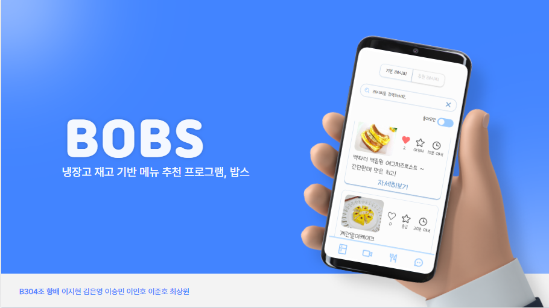
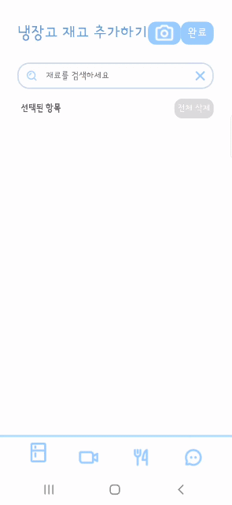
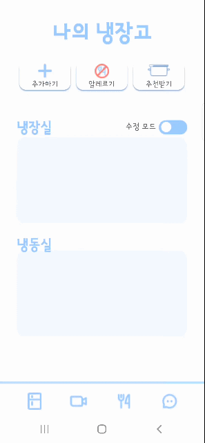
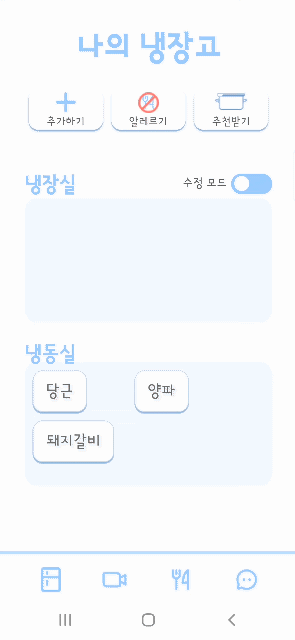
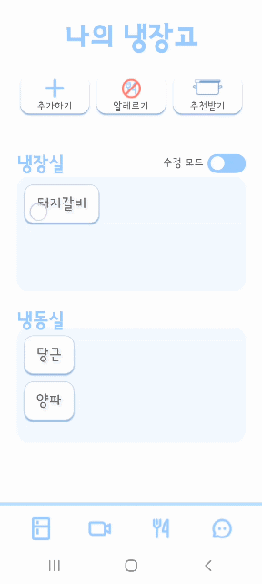
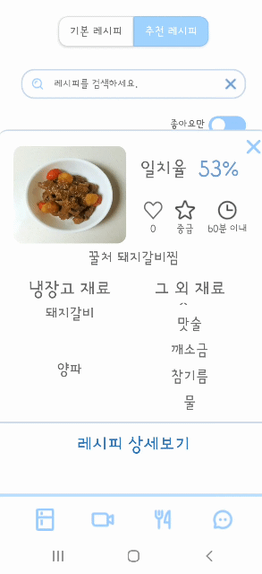
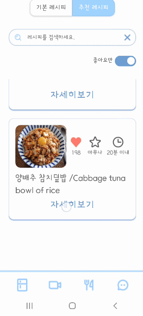
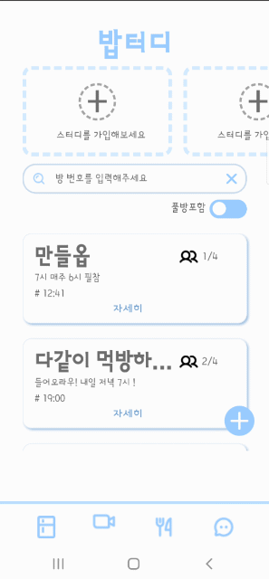
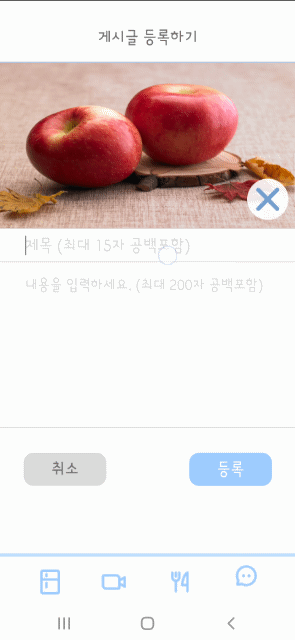

# ***BOBS***

## **: 1인 가구를 위한 냉장고 재고 기반 추천**

# ✔ Project Summary

### 개발 기간 : 2023.01/02 ~ 2023.02/17

## Back-Ground

- **1인 가구 증가**로 인한 배달음식 및 혼자 밥 먹는 사람 증가
- 냉장고에 음식 재료는 있지만 **어떻게 요리할 지 모르는** 사람들이 많음

## 시장 분석

- 가진 재료에 맞는 **레시피 추천 서비스의 부재**
- **쌍방향 먹방 서비스의 부재** (단방향만 존재함 ex. 유튜브)

## 서비스 설명

- 냉장고 **재고 기반** 레시피 추천
- 규칙적인 식습관과 외로운 자취생을 위해 같이 시간을 정해서 만날 수 있음

---

## 설계 및 산출물

- **ERD**

- **Architecture**

- **와이어프레임**

- [시연 시나리오](https://www.notion.so/d522ac04408047eb89d32d22da4cd492)
- [포팅 매뉴얼](https://www.notion.so/43f354fcfb904cb2870345835a8c7f48)
- [최종 발표 PPT](https://www.notion.so/PPT-c9a1df5bdf4d43fdb3761834d683d741)
- **UCC**

[https://youtu.be/-r0O_AVuJV4](https://youtu.be/-r0O_AVuJV4)

# ✔ Information

---

 

## 메인 기능

- 보유 재료, 우선 소비 선호도, 알레르기를 고려하여 메뉴 **필터링**
- 최대 4명까지의 **화상 통화**를 제공
- 약 **600개**의 레시피를 제공하여, 다양한 요리 방법 제시
- 간편하게 **사진을 찍어 인식**하여 재료 추가

## 추가 기능

- 카카오 로그인
- 나의 냉장고 재고 현황 추가 및 삭제
- 요리 커뮤니티

## 메인 기능 설명

- **사용자 정보 기반으로 최적화된 메뉴 추천**

사용자가 등록한 냉장고 재료와 레시피에서 제공하는 재료와의 **일치율**과,
냉장고에 등록한 재료의 **선호도에 따른 가중치**를 더하여 사용자 **맞춤형 레시피**를 제공함

- **이미지 기반 검색**

**딥러닝** 및 **Clarifai AI Tech**를 이용하였으며, 

사용자가 가진 재료를 촬영하거나 기존 갤러리에서 사진을 첨부하여 냉장고 재고를 추가함

## 기대 효과

- 배달 쓰레기 감소
- 규칙적인 식생활 형성
- 1인 가구 행복지수 상승

# ***We’re Bobs ! - Detail Pages***

---

- 카카오 **로그인**

- **이미지 인식 or 검색**을 통한 재고 추가

 

- 나의 냉장고 재고 수정
- 냉장실 → **우선 소비** 재료
- 냉동실 → **보유** 재료

- 보유 재료로 **레시피 추천**

- **좋아요**한 추천 레시피만 조회

- 레시피 **상세보기** 및 **다 쓴 재료** **삭제**

- **소모임** 가입 및 개설하여 **팀원들끼리만 소통**

### 

- 가입한 유저들이 모두 사용 가능한 **요리 커뮤니티**(게시글 수정/삭제, 댓글)

## ***더 자세한 기능 구현은***

### ***[시연 시나리오](https://www.notion.so/d522ac04408047eb89d32d22da4cd492) 를 참고해주세요 !***

## 개발 환경

---

### **Back-End**

| IntelliJ | 2022.3.1 |
| --- | --- |
| JDK | 11.0.13 |
| SpringBoot | 2.7.8 |
| dependency | 1.0.15 |
| gradle | 7.6 |
| jwt | 0.9.1 |
| JPA |  |

### Front-End

| Node.js | 18.13.0 |
| --- | --- |
| React | 18.2.0 |
| VS Code | 1.75.1 |
| Create-react-app | 5.0.1 |
| React-router-dom | 5.2.0 |
| npm | 8.19.3 |
| redux | 1.9.2 |
| CSS |  |

### Openvidu

- openvidu 2.19.0

## 배포(CI/CD)

---

- AWS EC2 - ubuntu os 20.04 LTS
- Docker
- Nginx
    - backend , frontend 포워딩 분기 처리
- Jenkins
    - pipeline 스크립트 작성으로 빌드 명령 자동화
    - webhook을 이용한 빌드 유발 자동 배포
- https
    - letsencrypty 인증서 발급(i8b304.p.ssafy.io](http://i8b304.p.ssafy.io/))

# ✔ **Cooperation**

---

## Tools

- Git
- Jira
- Notion
- MatterMost
- Webex
- Discord

## 팀원 소개

- 이지현 (팀장) - Back-End
- 이승민 (팀원) - Back-End
- 최상원 (팀원) - Back-End & DevOps
- 이인호 (팀원) - Front-End & Back-End
- 김은영 (팀원) - Front-End
- 이준호 (팀원) - Front-End

