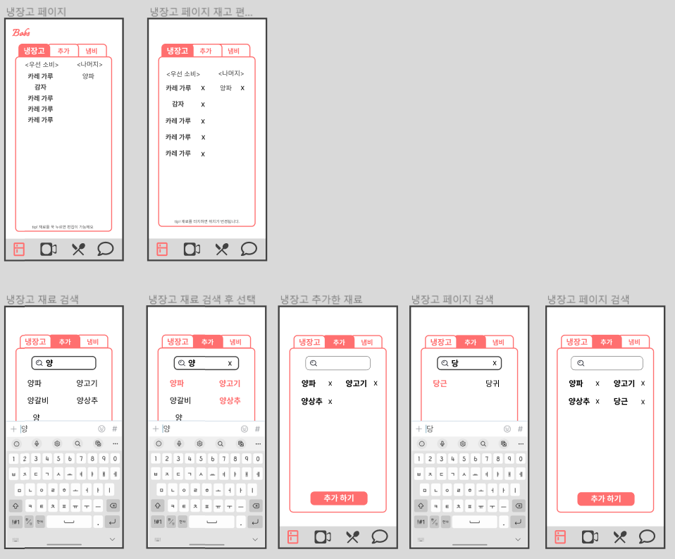
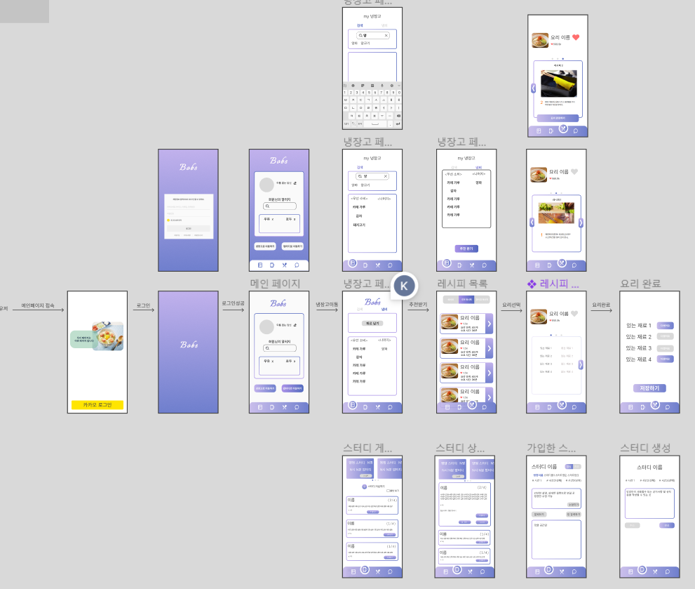

- 2013.01.16 (Mon) 
    - user flowchart 생성

        

    - jira 학습
    - front rule
        - 위 아래 공백을 주는 경우 : margin-top 을 줄 것.
        - 한 행에 한 개의 컨텐츠만 배치 할 것.
        - coding convention
            - 컴포넌트는 파스칼
            - 그 외는 카멜
            - unit 파일명은 대상 파일명과 동일하게 할 것.
            - optional chaning 연산자(?.) 사용.
            - 변수명은 명확하게
            - 1 code 1 주석(print, console 제외)
            - 변수명 : 이름_기능 형식으로
            - test 파일은 .test를 붙여준다.
            - boolean 은 is를 접두사로 붙인다.
            - 상수는 대문자로만 구성한다.
            - 함수명은 (on) + Event + Handler
            => 생각나는 대로 추가하는 걸로

- 2023.01.17 (Tue)
    - 요구사항 명세서 작성(냉장고/밥스터디)
        ## <요구 명세서> 밥터디

        - 최상단에 가입한 스터디가 보여야 한다. (최대 3개) : 최상단 고정
            - x축 스크롤(좌우로 이동)
        - 스터디 목록이 제공되어야 한다.
            - 최상단에 스터디 생성하기(+)
            - 스터디 이름
            - 가입 인원/4(최대 인원)
            - 스터디 설명(최대 50자)
            - 스케쥴 ex) #7시 #21시 30분
        - 스터디 선택 시 상세 보기 제공
            - 스터디 이름
            - 스터디 원
            - 스터디 소개
            - 가입하기 버튼(가입한 스터디가 3개 인 경우는 alert 요청 X) → 가입한 후 목록으로 이동
            - 스케쥴 표
            - 닫기 버튼(X)
        - 내가 가입한 스터디 상세 보기
            - 스터디 이름
            - 스터디 원
            - 스터디 소개
            - 탈퇴하기 / 참여하기
            - 방장인 경우( 방 생성 하기, 스터디 삭제하기)
        - 관리자 : 시간 1시간/30분 전에 스터디원들에게 알림 보내주기(활성화 여부는 일단 고려x)
        - 검색 기능 넣기(방 번호) / 풀 방 보기 (TRUE/FALSE)

        ## <요구 명세서> 냉장고

        - 냉장고에 재료가 있어야 됨(남은 거)
        - 재료를 검색추가/제거 가능해야 함 (드래그 엔 드롭스)(선택하면 아래 창에 x있고)
        - 재료를 추가할 냄비가 있어야 됨
        - 추천하기 버튼이 있어야 됨

    - 와이어 프레임 제작
   
   
         

- 2023.01.18 (Wed)
    - 요구사항 명세서 작성(레시피)

    ## <요구 명세서> 레시피

        ### 레시피 목록

        - 최상단에 검색기능이 가능해야함
        - 카테고리별 조회 기능 추가? (카테고리 없음)
        - 요리의 간단한 정보
            - 사진, 이름, 좋아요 개수
            - 좋아요 개수는 999개 넘을 시 k/m 단위로 사용
        - 사용자가 레시피의 좋아요 여부 확인할 수 있음, 색상으로 구분( 활성 / 비활성 )
        - 상세보기 버튼 클릭시 레시피 상세 페이지로 이동

        ### 레시피 상세

        - 사용자가 레시피의 좋아요 또는 좋아요 취소할 수 있음( 활성 / 비활성 )
        - 사용자는 레시피 상세보기창에서 댓글 작성,수정,삭제가 가능
        - 레시피의 디테일한 정보
            - 사진, 이름, 좋아요 개수, 재료, 조리법
            - 좋아요 개수는 999개 넘을 시 k/m 단위로 사용
            - 재료의 유무를 폰트 색상으로 구분 ( 활성 / 비활성 )
        - 댓글
            - 댓글 목록을 확인
            - 댓글 작성하기
            - 자신의 댓글 수정, 삭제

        ### 레시피 수정(?)

        ### 추천받은 레시피

        - 요리의 간단한 정보
            - 사진, 이름, 좋아요 개수(+일치율)?
            - 좋아요 개수는 999개 넘을 시 k/m 단위로 사용
        - 사용자가 레시피의 좋아요 여부 확인할 수 있음( 채워진 하트 / 빈 하트 )

        ### 추천 받은 레시피 상세

        - 사용자가 레시피의 좋아요 또는 좋아요 취소할 수 있음( 채워진 하트 / 빈 하트 )
        - 사용자는 레시피 상세보기창에서 댓글 작성,수정,삭제가 가능
        - 레시피의 디테일한 정보
            - 사진, 이름, 좋아요 개수, 재료, 조리법,
            - 재료의 유무를 폰트 색상으로 구분 ( 활성 / 비활성 )
            - 좋아요 개수는 999개 넘을 시 k/m 단위로 사용
        - 댓글
            - 댓글 목록을 확인
            - 댓글 작성하기
            - 자신의 댓글 수정, 삭제
        - 요리 시작 버튼

        ## 좋아요 한 레시피 페이지

        - 레시피 목록과 같으나 좋아요 한 레시피를 필터링 하여 제공
        - 레시피 상세 페이지는 동일

    - 와이어 프레임 제작
    
        

- 2023.01.19 (thu)

    - 마이페이지를 냉장고로 변경
    - 냉장고 페이지에 메인을 냄비/ 탭을 하여 검색 및 재고 등록 기능
    - 유저 스토리보드를 다시 고민
    - 요리 추천페이지를 새로 만들어야 할까?
    - 레시피 목록을 누르면 재료, 레시피를 보여주고 화살표 클릭시 레시피 진행 페이지로 보내기
    - 요리 완료의 시점을 어떻게 처리할 것인가?
        - 레시피의 마지막에 도달했을 때?
        - 사용자가 요리 완료 버튼을 누르도록 유도?

    ### 냉장고

    - 검색 아이콘을 클릭 시 검색창을 따로 띄운다?
    - 검색 후 선택 시 바로바로 들어가나?
        - 로컬에 저장했다 완료를 누르면 DB에 저장
    - 검색시 모바일이기 때문에 키보드 높이를 생각해야함
    - 우선순위 재료 이름은 메인색, 나머지는 초록색[글자색/비활성화색]
    - 재료를 꾸욱 누르면 편집모드에 진입
        - X를 누르면 재료 삭제
        - 터치 시 우선순위 재료는 나머지로 이동, 나머지는 우선순위 재료로 이동 (이동식 색변경)

    ### 밥터디

    - 상단에 다른 스터디원의 상태를 띄운다?
    - 더보기는 버튼이 아닌 단순 텍스트
    - 목록하나를 탭하면 상세가 펼쳐짐
    - 축소하는 건 없음
    - 상위의 내가 가입한  스터디를 보여줌, 스와이프로 넘김
        - 탭하면 스터디 상세 페이지로 이동
        - 화상이 열려있으면 우하단에 LIVE 버튼이 활성화, 클릭 시 화상채팅으로 바로 이동

    ## 오후

    - 마이페이지를 냉장고로 변경
    - 냉장고 페이지에 메인을 냄비/ 탭을 하여 검색 및 재고 등록 기능
    - 유저 스토리보드를 다시 고민
    - 요리 추천페이지를 새로 만들어야 할까?
    - 레시피 목록을 누르면 재료, 레시피를 보여주고 화살표 클릭시 레시피 진행 페이지로 보내기
    - 요리 완료의 시점을 어떻게 처리할 것인가?
        - 레시피의 마지막에 도달했을 때?
        - 사용자가 요리 완료 버튼을 누르도록 유도?

    ### 냉장고

    - 검색 아이콘을 클릭 시 검색창을 따로 띄운다?
    - 검색 후 선택 시 바로바로 들어가나?
        - 로컬에 저장했다 완료를 누르면 DB에 저장
    - 검색시 모바일이기 때문에 키보드 높이를 생각해야함
    - 우선순위 재료 이름은 메인색, 나머지는 초록색[글자색/비활성화색]
    - 재료를 꾸욱 누르면 편집모드에 진입
        - X를 누르면 재료 삭제
        - 터치 시 우선순위 재료는 나머지로 이동, 나머지는 우선순위 재료로 이동 (이동식 색변경)

    ### 밥터디

    - 상단에 다른 스터디원의 상태를 띄운다?
    - 더보기는 버튼이 아닌 단순 텍스트
    - 목록하나를 탭하면 상세가 펼쳐짐
    - 축소하는 건 없음
    - 상위의 내가 가입한  스터디를 보여줌, 스와이프로 넘김
        - 탭하면 스터디 상세 페이지로 이동
        - 화상이 열려있으면 우하단에 LIVE 버튼이 활성화, 클릭 시 화상채팅으로 바로 이동

    - 와이어 프레임 제작(커뮤니티)

        

- 2023.01.20 (fri)
    - 프앤 컴포넌트 구성
        # 로그인 전 페이지
            기본 소개-page_info
        # 로그인 페이지
            로그인-login
        # 메인
            최초 로그인  first_main
                -알러지 allergy
            최초 로그인 아닐시 main
        # 냉장고
            재고
                -수정 edit_item
                -기본 get_item
            냄비
                -기본 selected_item
            검색
                -검색결과 search_item
                -추가할 애들 add-item 
        # 밥터디
        가입한 스터디 목록 list_mystudy
        스터디 목록 list_bobtudy
        등록 create_bobtudy
        상세 detail_bobtudy
        댓글 comment_bobtudy
        # 레시피
        목록 list_recipe
        상세 
            -재료 item-recipe
            -요리단계 steps_recipe
            -댓글 comment_recipe
        # 커뮤니티
        게시물
            -게시물 목록 list_community
            -게시물 상세 detail_community
            -게시물 댓글 list_comment
        등록
            -게시글 등록 create_community
            -사진등록 create_photo
            -글 create_write
        # 화상채팅
            화상채팅
    - 와이어 프레임(냉장고 변경)

        

- 2023.01.25

    - 와이어 프레임(메인 컬러 / 구성 / assets 변경)
    

    - 컴포넌트 전체 구성 및 route

        

