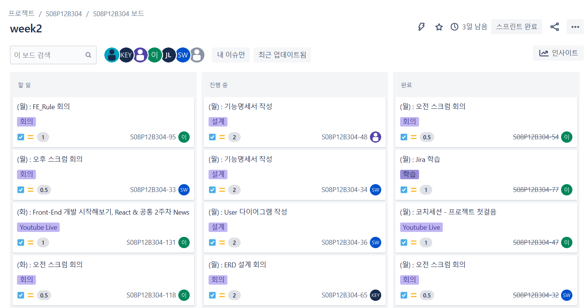
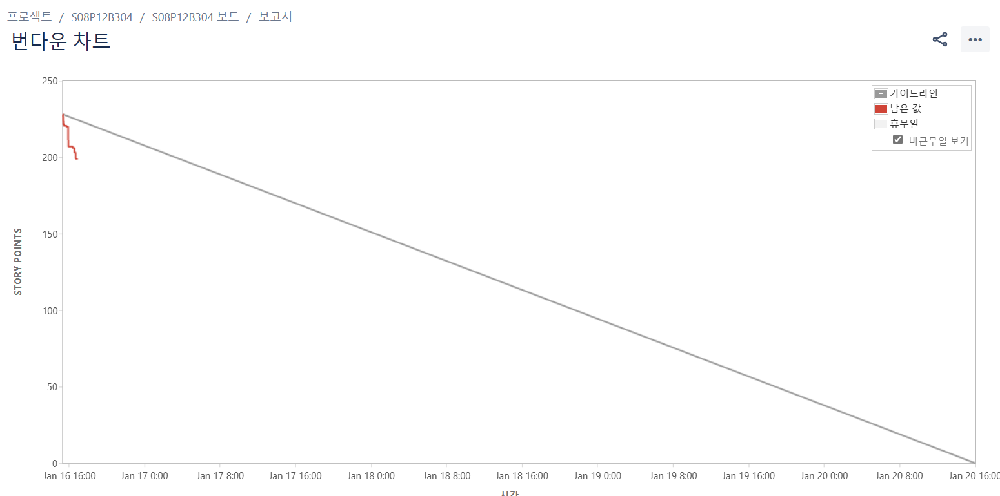
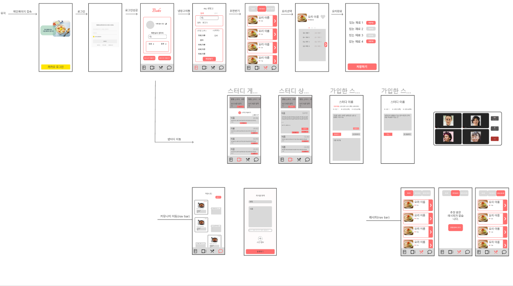

# 2주차 과제

# 20230117

1.Jira 학습
Jira는 짧은주기의 개발단위를 반복하여 프로젝트 완성시켜나가는 에자일 방식의 프로젝트 관리 협업 툴이다.

이슈-
이슈란 팀이 식별하고 있는 작업 항목의 단위로서, 하나의 업무 당 하나의 이슈가 배정된다.
그리고 이 이슈를 등록하고 관리하는 과정에서 우리는 업무 계획을 수립할 수 있고,
업무 사이클에 맞게 내게 주어진 일을 진행하고 완료할 수 있다.

정해진 업무에 따라 다른 이슈를 포함한 조금 더 큰 범주의 이슈를 뜻하는 에픽(Epic),
 사용자의 요구사항을 담은 스토리(Story), 태스크(Task), 버그(Bug) 등의 타입을 선택할 수 있다.

스프린트
스프린트란 지속적인 개발 주기 내에서 팀이 제품 백로그의 작업을 완료하는 고정된 기간이다. 
일반적으로 스프린트가 끝나면 팀에서는 잘 작동하는 제품 증분이 구축 및 구현되어 있다.
Jira Software는 실시간으로 스토리를 추정하고, 스프린트 범위를 조정하고, 속도를 확인하고, 
이슈의 우선 순위를 다시 지정할 수 있도록 백로그를 스프린트 계획 회의의 중심에 둔다.

번다운 차트
번다운 차트는 완료되어야 할 업무의 양을 추정하고 이를 업무를 완료하는 데 걸리는 시간에 매핑하는 방식으로 작동한다. 
시간 할당을 정확하게 특정하고 향후 리소스에 대한 계획을 세우는 것이 목표이다.

번다운 차트는 다양한 팀에서 사용되지만, 일반적으로 애자일 팀에서 주로 사용된다. 
번다운 차트는 스프린트 같은 짧은 반복 업무를 분석하는 데 최적이기 때문이다. 

2.ERD 설계 회의

3.Flowchart 작성

# 20230117

## <요구 명세서> 밥터디

- 최상단에 가입한 스터디가 보여야 한다. (최대 3개) : 최상단 고정
  - x축 스크롤(좌우로 이동)
- 스터디 목록이 제공되어야 한다.
  - 최상단에 스터디 생성하기(+)
  - 스터디 이름
  - 가입 인원/4(최대 인원)
  - 스터디 설명(최대 50자)
  - 스케쥴 ex) #7시 #21시 30분
- 스터디 선택 시 상세 보기 제공
  - 스터디 이름
  - 스터디 원
  - 스터디 소개
  - 가입하기 버튼(가입한 스터디가 3개 인 경우는 alert 요청 X) → 가입한 후 목록으로 이동
  - 스케쥴 표
  - 닫기 버튼(X)
- 내가 가입한 스터디 상세 보기
  - 스터디 이름
  - 스터디 원
  - 스터디 소개
  - 탈퇴하기 / 참여하기
  - 방장인 경우( 방 생성 하기, 스터디 삭제하기)
- 관리자 : 시간 1시간/30분 전에 스터디원들에게 알림 보내주기(활성화 여부는 일단 고려x)
- 검색 기능 넣기(방 번호) / 풀 방 보기 (TRUE/FALSE)

## <요구 명세서> 냉장고

- 냉장고에 재료가 있어야 됨(남은 거)
- 재료를 검색추가/제거 가능해야 함 (드래그 엔 드롭스)(선택하면 아래 창에 x있고)
- 재료를 추가할 냄비가 있어야 됨
- 추천하기 버튼이 있어야 됨

# 20230118

## <요구 명세서> 레시피

### 레시피 목록

- 최상단에 검색기능이 가능해야함
- 카테고리별 조회 기능 추가? (카테고리 없음)
- 요리의 간단한 정보
  - 사진, 이름, 좋아요 개수
  - 좋아요 개수는 999개 넘을 시 k/m 단위로 사용
- 사용자가 레시피의 좋아요 여부 확인할 수 있음, 색상으로 구분( 활성 / 비활성 )
- 상세보기 버튼 클릭시 레시피 상세 페이지로 이동

### 레시피 상세

- 사용자가 레시피의 좋아요 또는 좋아요 취소할 수 있음( 활성 / 비활성 )
- 사용자는 레시피 상세보기창에서 댓글 작성,수정,삭제가 가능
- 레시피의 디테일한 정보
  - 사진, 이름, 좋아요 개수, 재료, 조리법
  - 좋아요 개수는 999개 넘을 시 k/m 단위로 사용
  - 재료의 유무를 폰트 색상으로 구분 ( 활성 / 비활성 )
- 댓글
  - 댓글 목록을 확인
  - 댓글 작성하기
  - 자신의 댓글 수정, 삭제

### 레시피 수정(?)

### 추천받은 레시피

- 요리의 간단한 정보
  - 사진, 이름, 좋아요 개수(+일치율)?
  - 좋아요 개수는 999개 넘을 시 k/m 단위로 사용
- 사용자가 레시피의 좋아요 여부 확인할 수 있음( 채워진 하트 / 빈 하트 )

### 추천 받은 레시피 상세

- 사용자가 레시피의 좋아요 또는 좋아요 취소할 수 있음( 채워진 하트 / 빈 하트 )
- 사용자는 레시피 상세보기창에서 댓글 작성,수정,삭제가 가능
- 레시피의 디테일한 정보
  - 사진, 이름, 좋아요 개수, 재료, 조리법,
  - 재료의 유무를 폰트 색상으로 구분 ( 활성 / 비활성 )
  - 좋아요 개수는 999개 넘을 시 k/m 단위로 사용
- 댓글
  - 댓글 목록을 확인
  - 댓글 작성하기
  - 자신의 댓글 수정, 삭제
- 요리 시작 버튼

## 좋아요 한 레시피 페이지

- 레시피 목록과 같으나 좋아요 한 레시피를 필터링 하여 제공
- 레시피 상세 페이지는 동일

## <요구 명세서> 커뮤니티

## 와이어 프레임 제작

# 20230119

- 레시피 / 밥터디 검색 기능 추가
- 메인 페이지 → 처음 로그인 : 알러지 등록 페이지
    
                        ㄴ> my 냉장고
    
- 추천 레시피 리스트에서 사용자를 설득 할 수 있어야 한다.
    - 일치율
    - 좋아요 순
    
    → 사용자가 납득이 가는 추천 순서여야 한다.
    
- 목록에서 레시피 단계 수 / 조리 시간을 볼 수 있게 해주어야 함
- 현재 스터디 상태를 보여줌.
- 커뮤니티는 인스타그램 벤치 마킹 하는 것으로.
- 일반 레시피 제공( 상위 2개는 일주일 간 좋아요 갯수 / 등록 순(관리자) )

## 그 외

- 유저 성별 / 생일 정보는 빼는 게 좋다.
- 카카오 알림톡(유료 / 무료) 확인 필요
- 닉네임 변경 기능은 빼는걸로
- 레시피 단계는 통째로 가져와서 관리를 하는 것이 좋겠다.
- 댓글 / 좋아요 테이블은 다 분리하는 걸로

## 오전

## 오후

- 마이페이지를 냉장고로 변경
- 냉장고 페이지에 메인을 냄비/ 탭을 하여 검색 및 재고 등록 기능
- 유저 스토리보드를 다시 고민
- 요리 추천페이지를 새로 만들어야 할까?
- 레시피 목록을 누르면 재료, 레시피를 보여주고 화살표 클릭시 레시피 진행 페이지로 보내기
- 요리 완료의 시점을 어떻게 처리할 것인가?
    - 레시피의 마지막에 도달했을 때?
    - 사용자가 요리 완료 버튼을 누르도록 유도?

### 냉장고

- 검색 아이콘을 클릭 시 검색창을 따로 띄운다?
- 검색 후 선택 시 바로바로 들어가나?
    - 로컬에 저장했다 완료를 누르면 DB에 저장
- 검색시 모바일이기 때문에 키보드 높이를 생각해야함
- 우선순위 재료 이름은 메인색, 나머지는 초록색[글자색/비활성화색]
- 재료를 꾸욱 누르면 편집모드에 진입
    - X를 누르면 재료 삭제
    - 터치 시 우선순위 재료는 나머지로 이동, 나머지는 우선순위 재료로 이동 (이동식 색변경)

### 밥터디

- 상단에 다른 스터디원의 상태를 띄운다?
- 더보기는 버튼이 아닌 단순 텍스트
- 목록하나를 탭하면 상세가 펼쳐짐
- 축소하는 건 없음
- 상위의 내가 가입한  스터디를 보여줌, 스와이프로 넘김
    - 탭하면 스터디 상세 페이지로 이동
    - 화상이 열려있으면 우하단에 LIVE 버튼이 활성화, 클릭 시 화상채팅으로 바로 이동

## 오후

- 마이페이지를 냉장고로 변경
- 냉장고 페이지에 메인을 냄비/ 탭을 하여 검색 및 재고 등록 기능
- 유저 스토리보드를 다시 고민
- 요리 추천페이지를 새로 만들어야 할까?
- 레시피 목록을 누르면 재료, 레시피를 보여주고 화살표 클릭시 레시피 진행 페이지로 보내기
- 요리 완료의 시점을 어떻게 처리할 것인가?
    - 레시피의 마지막에 도달했을 때?
    - 사용자가 요리 완료 버튼을 누르도록 유도?

### 냉장고

- 검색 아이콘을 클릭 시 검색창을 따로 띄운다?
- 검색 후 선택 시 바로바로 들어가나?
    - 로컬에 저장했다 완료를 누르면 DB에 저장
- 검색시 모바일이기 때문에 키보드 높이를 생각해야함
- 우선순위 재료 이름은 메인색, 나머지는 초록색[글자색/비활성화색]
- 재료를 꾸욱 누르면 편집모드에 진입
    - X를 누르면 재료 삭제
    - 터치 시 우선순위 재료는 나머지로 이동, 나머지는 우선순위 재료로 이동 (이동식 색변경)

### 밥터디

- 상단에 다른 스터디원의 상태를 띄운다?
- 더보기는 버튼이 아닌 단순 텍스트
- 목록하나를 탭하면 상세가 펼쳐짐
- 축소하는 건 없음
- 상위의 내가 가입한  스터디를 보여줌, 스와이프로 넘김
    - 탭하면 스터디 상세 페이지로 이동
    - 화상이 열려있으면 우하단에 LIVE 버튼이 활성화, 클릭 시 화상채팅으로 바로 이동

# 20230120

## 오전

- ~~재료 탭에서 재료의 위치 순서를 변경~~
- 냄비 아이콘을 만들어서 선택된 재료는 냄비에 넣기
- 냄비 애니메이션을 만들어서 그 동안 레시피 목록 불러오기

## 오후

## 컴포넌트 구성
# 로그인 전 페이지

기본 소개-page_info

# 로그인 페이지

로그인-login

# 메인

최초 로그인  first_main

-알러지 allergy

최초 로그인 아닐시 main

# 냉장고

재고

-수정 edit_item

-기본 get_item

냄비

-기본 selected_item

검색

-검색결과 search_item

-추가할 애들 add-item 

# 밥터디

가입한 스터디 목록 list_mystudy

스터디 목록 list_bobtudy

등록 create_bobtudy

상세 detail_bobtudy

댓글 comment_bobtudy

# 레시피

목록 list_recipe

상세 

-재료 item-recipe

-요리단계 steps_recipe

-댓글 comment_recipe

# 커뮤니티

게시물

-게시물 목록 list_community

-게시물 상세 detail_community

-게시물 댓글 list_comment

등록

-게시글 등록 create_community

-사진등록 create_photo

-글 create_write

# 화상채팅

화상채팅

# 230125 정리

로그인 기능

import React from 'react';

function Login() {
  const CLIENT_ID = "6d5b3488701905eecd07dfc7034e45ec";
  const REDIRECT_URI =  "http://localhost:3000/oauth/callback/kakao";

  // 프런트엔드 리다이랙트 URI 예시
  // const REDIRECT_URI =  "http://localhost:3000/oauth/callback/kakao";

  // 백엔드 리다이랙트 URI 예시
  // const REDIRECT_URI =  "http://localhost:5000/kakao/code";

  const KAKAO_AUTH_URL = `https://kauth.kakao.com/oauth/authorize?client_id=${CLIENT_ID}&redirect_uri=${REDIRECT_URI}&response_type=code`;
    return (
      

        Login
        <a href={KAKAO_AUTH_URL}>
            <button>로그인</button>
        </a>
      

      
    );
    
  }
  
  

  export default Login;
  
로그인 받는 rest api 주소

import React, { useEffect } from "react";
import axios from 'axios';

const KakaoRedirectHandler = () => {
  useEffect(()=> {
    let params = new URL(document.location.toString()).searchParams;
    let code = params.get("code"); // 인가코드 받는 부분
    let grant_type = "authorization_code";
    let client_id = "6d5b3488701905eecd07dfc7034e45ec";

    console.log(code)
    axios.post(`https://kauth.kakao.com/oauth/token?
        grant_type=${grant_type}
        &client_id=${client_id}
        &redirect_uri=http://localhost:3000/oauth/callback/kakao
        &code=${code}`
        , {
    headers: {
        'Content-type': 'application/x-www-form-urlencoded;charset=utf-8'
    }
  }).then((res) => {
      console.log(res)
      // res에 포함된 토큰 받아서 원하는 로직을 하면된다.
  })
  }, [])

  return 
사실 이페이지는 크게 의미 없다. 첫화면으로 로직이 끝나면 이동시켜주면 된다.
;
};

export default KakaoRedirectHandler;

# 내비게이션 바

import "../nav.css" ;

function NavBar() {

    return (
      

            <input type="radio" id="one" name="buttons" defaultChecked/>
                <label htmlFor="one" className="icons home"></label>
            <input type="radio" id="two" name="buttons"/>
                <label htmlFor="two" className="icons search"></label>
            <input type="radio" id="three" name="buttons"/>
                <label htmlFor="three" className="icons heart"></label>
            <input type="radio" id="four" name="buttons"/>
                <label htmlFor="four" className="icons bell"></label>
            

            

            

            Home
            Search
            Likes
            Notifications

            

            

      

    );
  }
  
  export default NavBar;

# 내비게이션 바 css
*{
  margin:0;
  padding:0;
}

input{
  display:none;
}
label.icons{
transition: transform ease .5s,color  ease .5s;
  font-size:25px;
  position: absolute;
  z-index: 3;
color:rgb(155, 143, 143);
left:50%;
top:50%;
transform: translate(-50%,-50%);
}
label.home{
  transform: translate(-135px,-20px);
}
label.search{
  transform: translate(-50px,-20px);
}
label.heart{
  transform: translate(30px,-20px);
}
label.bell{
  transform: translate(120px,-20px);
}
div#box{
  z-index: 1;
  width:350px;
  height:100px;
  background: linear-gradient(to right, #C1B1EC, #6F7FCD);
  box-shadow:0px 1px 2px black;
  position: absolute;
  border-bottom-left-radius: 30px;
  border-bottom-right-radius: 30px;
  top:50%;
  left:50%;
  transform:translate(-50%,-50%);
  border:1px solid white;
}

span.title{
  transition: color.5s,transform .5s,opacity .5s;
  font-size:13px;
  position: absolute;
  z-index: 2;
color:rgb(155, 143, 143);
left:50%;
top:50%;
transform: translate(-50%,-50%);
opacity: 0;
}
span.home{
  transform: translate(-135px,28px);
}
span.search{
  transform:translate(-50px,28px);
}
span.heart{
  transform:translate(33px,28px);
}
span.bell{
  transform:translate(98px,28px);
}
#one:checked~label.home{
  transform: translate(-135px,-68px);
  color:rgb(97, 218, 157);
}
#two:checked~label.search{
  transform: translate(-48px,-64px);
  color:rgb(236, 202, 47);
}
#three:checked~label.heart{
  transform: translate(30px,-68px);
  color:rgb(240, 78, 105);
}
#four:checked~label.bell{
  transform: translate(120px,-68px);
  color:rgb(58, 83, 224);
}

#one:checked~span.home{
color:rgb(97, 218, 157);
opacity:1;
transform: translate(-135px,0px);
}
#two:checked~span.search{
color:rgb(236, 202, 47);
opacity:1;
transform:translate(-50px,0px);
}
#three:checked~span.heart{
  color:rgb(240, 78, 105);
  opacity:1;
  transform:translate(33px,0px);
}
#four:checked~span.bell{
color: rgb(58, 83, 224);
transform:translate(98px,0px);
  opacity:1;
}
div.border{
  position: absolute;
 
  z-index: 2;
  top:50%;
  left:50%;
  transform: translate(-50%,-50%);
  border:6px solid rgb(97, 218, 157);
  width:45px;
  height: 45px;
  background-color: white;
  transition: border .5s,transform .5s,border-radius .3s;
}
div.fst{
  transform:translate(-144px,-75px);
}
#one:checked~div.border{
  border:6px solid rgb(97, 218, 157);
  transform:translate(-144px,-75px);
  border-radius: 0%;
}
#two:checked~div.border{
  border:6px solid rgb(236, 202, 47);
  transform:translate(-60px,-75px);
  border-radius: 50%;
  width:50px;
  height: 50px;
}
#three:checked~div.border{
  border:6px solid rgb(240, 78, 105);
  transform:translate(22px,-75px) ;
  transform-origin: center center;
  outline-color: rgb(240, 78, 105);
  border-radius: 0px 0px 50px 50px;
}

#four:checked~div.border{
  border:6px solid rgb(58, 83, 224);
  transform:translate(110px,-75px) ;
  border-top-left-radius: 50%;
  border-top-right-radius: 50%;
 
}
div.effect{
  position: absolute;
  top:50%;
  left:50%;
  transform: translate(-50%,-50%);

}

span{
cursor:pointer
}

# 230126 로그아웃 구현

  function KakaoLogout() {
    
    console.log(access_token);
    axios.post(`https://kapi.kakao.com/v1/user/logout`
        ,{},{
    headers: {
      "Authorization": "Bearer "+access_token
    }
  }).then((res) => {
      console.log(res);
        
    })
  }
  
  
  return(
    

      <button className="bg-red-500" onClick={KakaoLogout}>
        로그아웃
      </button>
    

  ) ;
};

# nav bar css 수정

.Nav{
  margin:0;
  padding:0;
  position: fixed;
  left: 0;
  right: 0;
  bottom: 0;
  height: 6rem;

}

input{
  display:none;
}
label.icons{
transition: transform ease .5s,color  ease .5s;
  font-size:25px;
  position: absolute;
  z-index: 3;
color:white;
left:50%;
top:50%;
transform: translate(-50%,-50%);
}
label.home{
  transform: translate(-135px,-20px);
}
label.search{
  transform: translate(-50px,-20px);
}
label.heart{
  transform: translate(30px,-20px);
}
label.bell{
  transform: translate(120px,-20px);
}
div#box{
  z-index: 1;
  width:400px;
  height:100px;
  background: linear-gradient(to right, #C1B1EC, #6F7FCD);
  box-shadow:0px 1px 2px black;
  position: absolute;
  border-bottom-left-radius: 30px;
  border-bottom-right-radius: 30px; 
  top:50%;
  left:50%;
  transform:translate(-50%,-50%);
  border:1px solid white;
  border-top-left-radius: 30px;
  border-top-right-radius: 30px;
}

span.title{
  transition: color.5s,transform .5s,opacity .5s;
  font-size:13px;
  position: absolute;
  z-index: 2;
color:rgb(155, 143, 143);
left:50%;
top:50%;
transform: translate(-50%,-50%);
opacity: 0;
}
span.home{
  transform: translate(-135px,28px);
}
span.search{
  transform:translate(-50px,28px);
}
span.heart{
  transform:translate(33px,28px);
}
span.bell{
  transform:translate(98px,28px);
}
#one:checked~label.home{
  transform: translate(-135px,-68px);
  color:white;
}
#two:checked~label.search{
  transform: translate(-48px,-64px);
  color:white;}
#three:checked~label.heart{
  transform: translate(30px,-68px);
  color:white;}
#four:checked~label.bell{
  transform: translate(120px,-68px);
  color:white;}

#one:checked~span.home{
color:rgb(97, 218, 157);
opacity:1;
transform: translate(-135px,0px);
}
#two:checked~span.search{
color:rgb(236, 202, 47);
opacity:1;
transform:translate(-50px,0px);
}
#three:checked~span.heart{
  color:rgb(240, 78, 105);
  opacity:1;
  transform:translate(33px,0px);
}
#four:checked~span.bell{
color: rgb(58, 83, 224);
transform:translate(98px,0px);
  opacity:1;
}
div.border{
  position: absolute;
  z-index: 2;
  top:50%;
  left:50%;
  transform: translate(-50%,-50%);
  border:6px solid rgb(97, 218, 157);
  width:45px;
  height: 45px;
  background: linear-gradient(to right, #C1B1EC, #6F7FCD);
  transition: border .5s,transform .5s,border-radius .3s;
}
div.fst{
  transform:translate(-144px,-75px);
}
#one:checked~div.border{
  border:6px solid white;
  transform:translate(-144px,-75px);
  border-radius: 50%;
  width:50px;
  height: 50px;
}
#two:checked~div.border{
  border:6px solid white;
  transform:translate(-60px,-75px);
  border-radius: 50%;
  width:50px;
  height: 50px;
}
#three:checked~div.border{
  border:6px solid white;
  transform:translate(22px,-75px) ;
  transform-origin: center center;
  border-radius: 50%;
  width:50px;
  height: 50px;
}

#four:checked~div.border{
  border:6px solid white;
  transform:translate(110px,-75px) ;
  border-radius: 50%;
  width:50px;
  height: 50px;
 
}
div.effect{
  position: absolute;
  top:50%;
  left:50%;
  transform: translate(-50%,-50%);

}

span{
cursor:pointer
}

# 230127 Nav bar 수정
import "./nav.css" ;
import {useNavigate  } from "react-router-dom";

function NavBar() {
    const navigate = useNavigate();

    const toRefridgerator = (e) =>{
        navigate("/refridgerator");
    };

    const toStudy = (e) =>{
        navigate("/study");
    };

    const toRecipe = (e) =>{
        navigate("/recipe");
    };

    const toCommunity = (e) =>{
        navigate("/community");
    };
    return (
      

            <input type="radio" id="one" name="buttons" onClick={toRefridgerator} defaultChecked />
                <label htmlFor="one" className="icons home"></label>
            <input type="radio" id="two" name="buttons" onClick={toStudy}/>
                <label htmlFor="two" className="icons search"></label>
            <input type="radio" id="three" name="buttons" onClick={toRecipe}/>
                <label htmlFor="three" className="icons heart"></label>
            <input type="radio" id="four" name="buttons" onClick={toCommunity}/>
                <label htmlFor="four" className="icons bell"></label>
            

            

            

            
            
            
            

            

            

      

    );
  }
  
  export default NavBar;

  # 230130 냉장고 페이지 메인 페이지 추가

# 냉장고페이지

function refridgeratorPage() {
  return (
    

      
나의 냉장고

      

        <AddItem></AddItem>
        <EditItem></EditItem>
        <GetItem></GetItem>
      

      

        

          우선소비
        

        
        <SelectedItem></SelectedItem>
      

      
      

        

          일반
        

        <SelectedItem></SelectedItem>
      

      
    

  );
}

export default refridgeratorPage;

# 메인페이지
function MainPage() {

  return (
    

      

        

        
        
        

          

            

            
<b>이름</b>

          

          
          

            
<b>회원님의 알러지</b>

            <form action="#">
              <input type="search" required/>
                <i className="bi bi-search"></i>
              

            </form>
          

          <Allergy>
            <Link to="/login"> Login</Link>    
          </Allergy>        
          
            
            <FirstMain></FirstMain>
            <Main></Main>
        

        
      

        
    

  );
}

export default MainPage;

# 230131

import "./css/StudyInfo.css"

function StudyInfo() {
    
    return (
        

              
                
이름

                
스터디 짧 정보

                
                
#n시

                
방장

                
스터디 정보

                <input id="study_btn" type="checkbox"></input>
                <label htmlFor="study_btn"></label>
                

                

                    <h2 className="accordion-header" id="headingOne">
                    <button className="accordion-button" type="button" data-bs-toggle="collapse" data-bs-target="#collapse1" aria-expanded="true" aria-controls="collapse1">
                        자세히 보기
                    </button>
                    </h2>
                    

                    

                        <strong>This is the first item's accordion body.</strong> It is shown by default, until the collapse plugin adds the appropriate classes that we use to style each element. These classes control the overall appearance, as well as the showing and hiding via CSS transitions. You can modify any of this with custom CSS or overriding our default variables. It's also worth noting that just about any HTML can go within the <code>.accordion-body</code>, though the transition does limit overflow.
                    

                    

                

                
                

        

    );
  }
  
  export default StudyInfo;
  
  # 230201 create StudyDetailChat

  import React from "react";
import "./css/StudyDetailChat.css"
import sendicon from "../../img/send.png";

function detectURL(message) {
	var urlRegex = /(((https?:\/\/)|(www\.))[^\s]+)/g;
	return message.replace(urlRegex, function(urlMatch) {
		return '<a href="' + urlMatch + '">' + urlMatch + '</a>';
	})
}

class InputMessage extends React.Component {
	constructor(props, context) {
		super(props, context);
		this.handleSendMessage = this.handleSendMessage.bind(this);
		this.handleTyping = this.handleTyping.bind(this);
	}
	handleSendMessage(event) {
		event.preventDefault();
		/* Disable sendMessage if the message is empty */
		if( this.messageInput.value.length > 0 ) {
			this.props.sendMessageLoading(this.ownerInput.value, this.ownerAvatarInput.value, this.messageInput.value);
			/* Reset input after send*/
			this.messageInput.value = '';
		}
	}
	handleTyping(event) {
		if( this.messageInput.value.length > 0 ) {
			this.props.typing(this.ownerInput.value);
		}
		else {
			this.props.resetTyping(this.ownerInput.value);
		}
	}
	render() {
		/* If the chatbox state is loading, loading class for display */
		var loadingClass = this.props.isLoading ? 'chatApp__convButton--loading' : '';
		return (
			<form className="mes-form" onSubmit={this.handleSendMessage} > 
				<input
					type="hidden"
					ref={owner => (this.ownerInput = owner)}
					value={this.props.owner}
				/>
				<input
					type="hidden"
					ref={ownerAvatar => (this.ownerAvatarInput = ownerAvatar)}
					value={this.props.ownerAvatar}
				/>
				<input
					type="text"
					ref={message => (this.messageInput = message)}
					className={"chatApp__convInput"}
					placeholder="Text message"
					onKeyDown={this.handleTyping}
					onKeyUp={this.handleTyping}
					tabIndex="0"
                    />
				

                    
				

			</form>
		);
	}
}

class TypingIndicator extends React.Component {

	render() {
		let typersDisplay = '';
		let countTypers = 0;
		/* for each user writing messages in chatroom */
		for ( var key in this.props.isTyping ) {
			/* retrieve the name if it isn't the owner of the chatbox */
			if( key !== this.props.owner && this.props.isTyping[key] ) {
				typersDisplay += ', ' + key;
				countTypers++;
			}
		}
		/* formatting text */
		typersDisplay = typersDisplay.substr(1);
		typersDisplay += (( countTypers > 1 ) ? ' are ' : ' is ');
		/* if at least one other person writes */
		if ( countTypers > 0 ) {
			return (
				
{typersDisplay} writing
				
				

			);
		}
		return (
			

		);
	}
}

class MessageList extends React.Component {

	render() {
		return (
			

			{this.props.messages.slice(0).reverse().map(
				messageItem => (
					<MessageItem
						key={messageItem.id}
						owner={this.props.owner}
						sender={messageItem.sender}
						senderAvatar={messageItem.senderAvatar}
						message={messageItem.message}
					/>
				)
			)}
			

		);
	}
}

class MessageItem extends React.Component {
	render() {
		/* message position formatting - right if I'm the author */
		let messagePosition = (( this.props.owner === this.props.sender ) ? 'chatApp__convMessageItem--right' : 'chatApp__convMessageItem--left');
		return (
			

				
				

			

		);
	}
}

class ChatBox extends React.Component {
	constructor(props, context) {
		super(props, context);
		this.state = {
			isLoading: false
		};
		this.sendMessageLoading = this.sendMessageLoading.bind(this);
	}
	/* catch the sendMessage signal and update the loading state then continues the sending instruction */
	sendMessageLoading(sender, senderAvatar, message) {
		this.setState({ isLoading: true });
		this.props.sendMessage(sender, senderAvatar, message);
		setTimeout(() => {
			this.setState({ isLoading: false });
		}, 400);
	}
	render() {
		return (
			

				
				<MessageList
					owner={this.props.owner}
					messages={this.props.messages}
				/>
				

					<TypingIndicator
						owner={this.props.owner}
						isTyping={this.props.isTyping}
					/>
					<InputMessage
						isLoading={this.state.isLoading}
						owner={this.props.owner}
						ownerAvatar={this.props.ownerAvatar}
						sendMessage={this.props.sendMessage}
						sendMessageLoading={this.sendMessageLoading}
						typing={this.props.typing}
						resetTyping={this.props.resetTyping}
					/>
				

			

		);
	}
}

class StudyDetailChat extends React.Component {
	constructor(props, context) {
		super(props, context);
		this.state = {
			messages: [{
				id: 1,
				sender: 'Shun',
				senderAvatar: 'https://i.pravatar.cc/150?img=32',
				message: 'Hello 👋'
			},
			{
				id: 2,
				sender: 'Gabe',
				senderAvatar: 'https://i.pravatar.cc/150?img=56',
				message: 'Hey!'
			},
			{
				id: 3,
				sender: 'Gabe',
				senderAvatar: 'https://i.pravatar.cc/150?img=56',
				message: 'How are you?'
			},
			{
				id: 4,
				sender: 'Shun',
				senderAvatar: 'https://i.pravatar.cc/150?img=32',
				message: 'Great! It\'s been a while... 🙃'
			},
			{
				id: 5,
				sender: 'Gabe',
				senderAvatar: 'https://i.pravatar.cc/150?img=56',
				message: 'Indeed.... We\'re gonna have to fix that. 🌮🍻'
			}
			],
			isTyping: [],
		};
		this.sendMessage = this.sendMessage.bind(this);
		this.typing = this.typing.bind(this);
		this.resetTyping = this.resetTyping.bind(this);
	}
	/* adds a new message to the chatroom */
	sendMessage(sender, senderAvatar, message) {
		setTimeout(() => {
			let messageFormat = detectURL(message);
			let newMessageItem = {
				id: this.state.messages.length + 1,
				sender: sender,
				senderAvatar: senderAvatar,
				message: messageFormat
			};
			this.setState({ messages: [...this.state.messages, newMessageItem] });
			this.resetTyping(sender);
		}, 400);
	}
	/* updates the writing indicator if not already displayed */
	typing(writer) {
		if( !this.state.isTyping[writer] ) {
			let stateTyping = this.state.isTyping;
			stateTyping[writer] = true;
			this.setState({ isTyping: stateTyping });
		}
	}
	/* hide the writing indicator */
	resetTyping(writer) {
		let stateTyping = this.state.isTyping;
		stateTyping[writer] = false;
		this.setState({ isTyping: stateTyping });
	}
	render() {
		let users = {};
		let chatBoxes = [];
		let messages = this.state.messages;
		let isTyping = this.state.isTyping;
		let sendMessage = this.sendMessage;
		let typing = this.typing;
		let resetTyping = this.resetTyping;

		/* user details - can add as many users as desired */
		users[0] = { name: 'Shun', avatar: 'https://i.pravatar.cc/150?img=32' };
		// users[1] = { name: 'Gabe', avatar: 'https://i.pravatar.cc/150?img=56' };
		/* test with two other users :)
		users[2] = { name: 'Kate', avatar: 'https://i.pravatar.cc/150?img=47' };
		users[3] = { name: 'Patrick', avatar: 'https://i.pravatar.cc/150?img=14' };
		*/
		
		Object.keys(users).map(function(key) {
			var user = users[key];
			chatBoxes.push(
				<ChatBox
					key={key}
					owner={user.name}
					ownerAvatar={user.avatar}
					sendMessage={sendMessage}
					typing={typing}
					resetTyping={resetTyping}
					messages={messages}
					isTyping={isTyping}
				/>
			);
            return null;
		});
		return (
			

				{chatBoxes}
			

		);
	}
}

export default StudyDetailChat;

# 230202 create communitypage

import CommunityPost from "./components/community/CommunityPost";
import './css/CommunityPage.css';

function CommunityPage() {
    return (
      

        

          커뮤니티 
        

        

          

            글쓰기
          

          

            내가쓴글
          

        

        

            <CommunityPost>
            </CommunityPost>
        

      

    );
  }
  
  export default CommunityPage;

  # create communitypage

  import { useParams } from "react-router-dom";
import CommunityDetailChat from "./components/bobtudy/StudyDetailChat";
import foodimg from "./img/food.jpg";
import heartimg from "./img/heart.png";
import proimg from "./img/nor.jpeg";
import './css/CommunityPostDetail.css';

function CommunityPostDetail() {
    const {id} = useParams();
    return(
        

            

                

                

                     팀원
                

            

            
안뇽 여기는 {id}방

            

                

                    
                    
                    </img>
                    

                        
                    

                

                
                

                    
제목
 
                    
내용 

                

            
            

                <CommunityDetailChat></CommunityDetailChat>
            

        

    ); 
}

export default CommunityPostDetail

# 230203 커뮤니티 포스트 등록 페이지 
import './css/CommunityPostCreate.css';
import{ useState,useRef } from "react";
import defaultimg from "./img/defaultimg.png";
function CommunityPostCreate(props) {

  const [fileImage, setFileImage] = useState(defaultimg);
  const imageInput = useRef();
  
  const saveFileImage = (e) => {
    setFileImage(URL.createObjectURL(e.target.files[0]));
  };

  // const deleteFileImage = () => {
  //   URL.revokeObjectURL(fileImage);
  //   setFileImage("");
  // };
  const uploadimg = () => {
    imageInput.current.click();
  }

  return(
    

        

            {fileImage && (
              
            )}
          

          <input
              name="imgUpload"
              type="file"
              accept="image/*"
              ref={imageInput}
              onChange={saveFileImage}
          >
          </input>
          

            

            {/* <button onClick={() => deleteFileImage()}>
              삭제
            </button> */}
          

          

            <input
                className='post-title'
                type="text"
                placeholder='제목을 입력하세요'
            />

            

              <textarea
                  className='post-content'
                  type="text"
                  placeholder='내용을 입력하세요'
              />
            

          

          

              

                취소
              

              

                등록
              

          

    

  );
}

export default CommunityPostCreate;

# 커뮤니티 디테일 페이지
// import { useState } from "react";
import "./css/recipeDetailPage.css"
function RecipeDetailPage() {
  const foodimg=""
  // const [foodimg,setfoodimg]=useState("")
  
  return (
      

        

          

            왼쪽
          

          

            n/4
          

          

            오른쪽
          

        

        

        

        
        

          안녕안녕
        

      

    );
  }
  
  export default RecipeDetailPage;