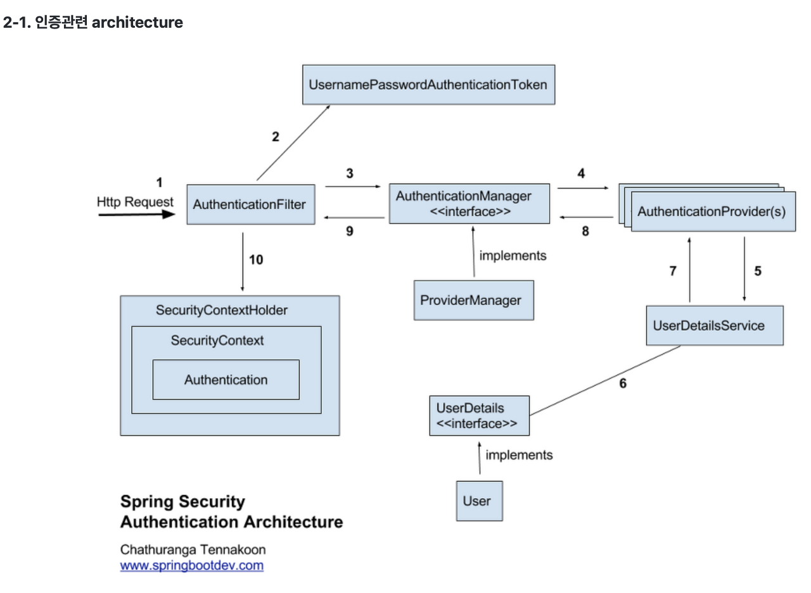
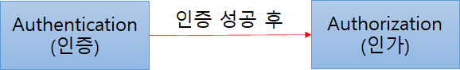
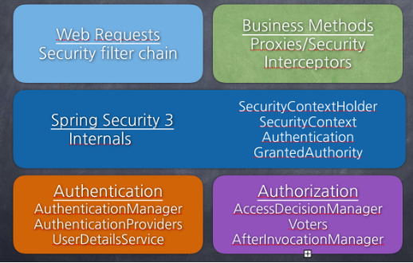

# 2주차 과제

## Spring Security

Spring 기반의 애플리케이션의 보안(인증과 권한, 인가 등)을 담당하는 스프링 하위 프레임워크이다. Spring Security는 '인증'과 '권한'에 대한 부분을 Filter 흐름에 따라 처리한다. 
Spring Security는 보안과 관련해서 체계적으로 많은 옵션을 제공해주기 때문에 개발자 입장에서는 일일이 보안관련 로직을 작성하지 않아도 된다는 장점이 있다.
 

- Spring Security Architechure
  

 

### 인증(Authorizatoin)과 인가(Authentication)

- 인증(Authentication): 해당 사용자가 본인이 맞는지를 확인하는 절차
- 인가(Authorization): 인증된 사용자가 요청한 자원에 접근 가능한지를 결정하는 절차

  

  Spring Security는 기본적으로 인증 절차를 거친 후에 인가 절차를 진행하게 되며, 인가 과정에서 해당 리소스에 대한 접근 권한이 있는지 확인을 하게 된다. 
  Spring Security에서는 이러한 인증과 인가를 위해 Principal을 아이디로, Credential을 비밀번호로 사용하는 Credential 기반의 인증 방식을 사용한다. 

  - Principal(접근 주체): 보호받는 Resource에 접근하는 대상
  - Credential(비밀번호): Resource에 접근하는 대상의 비밀번호
     
     

### Spring Security 모듈

- SecurityContextHolder: 보안 주체의 세부 정보를 포함하여 응용프래그램의 현재 보안 컨텍스트에 대한 세부 정보가 저장된다. 기본적으로 SecurityContextHolder.MODE_INHERITABLETHREADLOCAL 방법과SecurityContextHolder.MODE_THREADLOCAL 방법을 제공한다.
- SecurityContext: Authentication을 보관하는 역할을 하며, SecurityContext를 통해 Authentication 객체를 꺼내올 수 있다.
- Authentication: 현재 접근하는 주체의 정보와 권한을 담는 인터페이스이다. Authentication 객체는 Security Context에 저장되며, SecurityContextHolder를 통해 SecurityContext에 접근하고, SecurityContext를 통해 Authentication에 접근할 수 있다.
