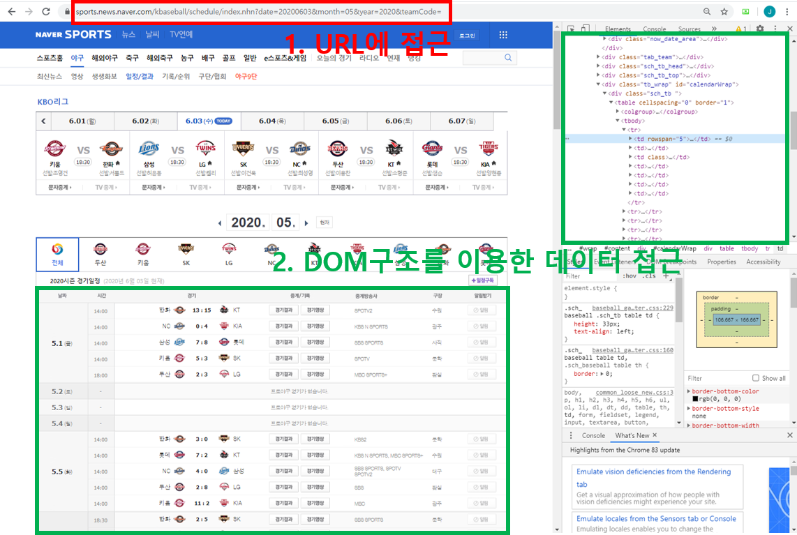
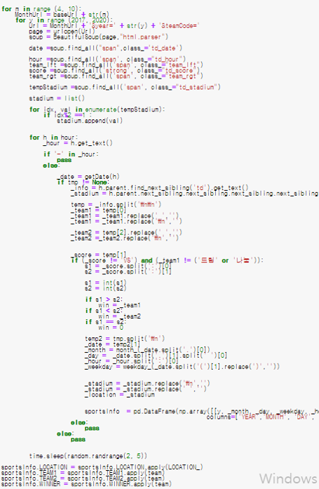
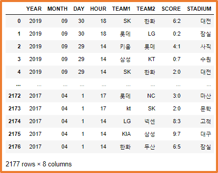
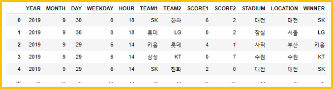

# 크롤링

Web상에 존재하는 Contents를 수집하는 작업 (프로그래밍으로 자동화 가능).
 

1. HTML 페이지를 가져와서, HTML/CSS등을 파싱하고, 필요한 데이터만 추출하는 방법. 
2. Open API(Rest API)를 제공하는 서비스에 Open API를 호출해서, 받은 데이터 중 필요한 데이터만 추출하는 방법.
3. Selenium등 브라우저를 프로그래밍으로 조작해서, 필요한 데이터만 추출하는 방법.

## 예제

### 네이버 스포츠(야구) 데이터 크롤링하기 (using Selenium)

 

- 2017년 ~ 2019년도의 야구 경기 데이터 수집
  (날짜, 경기, 경기시간, 점수, 구장)
  

- 추출한 데이터 확인
  

- 데이터 전처리 1. 구단명 변경사항 적용 (넥센 -> 키움, kt ->KT) 2. 이벤트성 경기 제거 (드림 vs 나눔) 3. 승리한 팀을 나타내는 Feature생성 (target이기 때문) 4. 취소된 경기 제거 (조건문 사용) 5. 무승부일 경우의 처리 (무승부:0) 6. 구장별 지역 파싱(날씨 데이터 반영을 위해)
   
   
- 전처리 후의 데이터 확인
  
