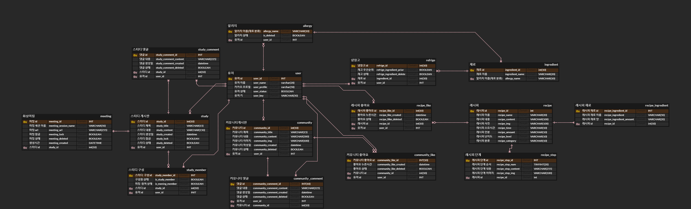

# ERD 수정



- _status 컬럼명이 애매함 -> _deleted로 수정
- 생성시간 나타내는 컬럼명들이 규칙이 없음 -> _created로 변경
- 알러지별 재료들을 검색할수 있도록 알러지이름(allergy_name) 를 추가함
- 엔티티 매핑을 위해 pk 추가함.

# 엔티티 매핑
## ERD 기준으로 연관관계 매핑
- @ManyToOne (다대일)
- @OneToMany(일대다)
- @OneToOne(일대일)

</br>
예시

### User.java (사용자 엔티티)

``` java
package com.b304.bobs.entity;

import lombok.*;

import javax.persistence.*;
import java.util.ArrayList;
import java.util.List;

@Entity
@Table(name="user")
@Getter @Setter
@Builder
@AllArgsConstructor
@NoArgsConstructor
public class User {
    @Id
    @Column(name="user_id")
    @GeneratedValue(strategy = GenerationType.IDENTITY)
    private String user_id;

    @Column(name="user_name")
    private String user_name;
    @Column(name="user_profile")
    private String user_profile;
    @Column(name="user_status")
    private Boolean user_status;
    @Column(name="user_key")
    private String user_key;

    @OneToMany(mappedBy = "user")
    List<Allergy> allergies = new ArrayList<Allergy>();

    @OneToMany(mappedBy = "user")
    List<Community> communities = new ArrayList<Community>();

    @OneToMany(mappedBy = "user")
    List<Study> studies = new ArrayList<Study>();

    @OneToMany(mappedBy = "user")
    List<Refrige> refriges = new ArrayList<Refrige>();

    @OneToOne
    @JoinColumn(name="community_like")
    private CommunityLike community_like;

    public void addAllergy(Allergy allergy){
        allergies.add(allergy);
        allergy.setUser(this);
    }

    public void addCommunity(Community community){
        communities.add(community);
        community.setUser(this);
    }

    public void addStudy(Study study){
        studies.add(study);
        study.setUser(this);
    }

    public void addRefrige(Refrige refrige){
        refriges.add(refrige);
        refrige.setUser(this);
    }
}  
