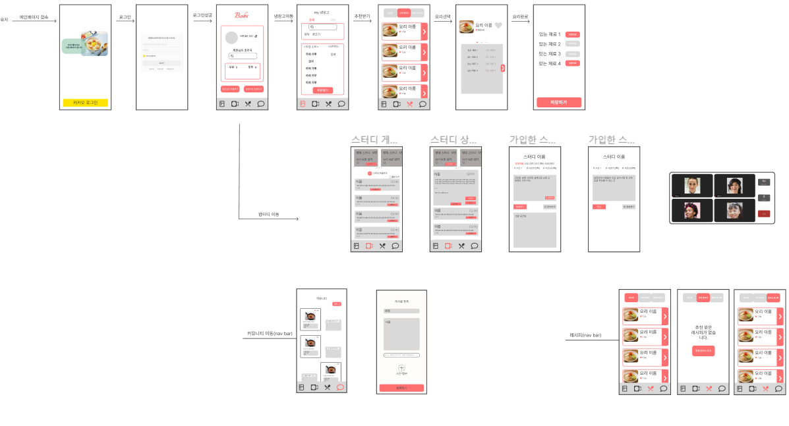

20230118

## <요구 명세서> 레시피

### 레시피 목록

- 최상단에 검색기능이 가능해야함
- 카테고리별 조회 기능 추가? (카테고리 없음)
- 요리의 간단한 정보
  - 사진, 이름, 좋아요 개수
  - 좋아요 개수는 999개 넘을 시 k/m 단위로 사용
- 사용자가 레시피의 좋아요 여부 확인할 수 있음, 색상으로 구분( 활성 / 비활성 )
- 상세보기 버튼 클릭시 레시피 상세 페이지로 이동

### 레시피 상세

- 사용자가 레시피의 좋아요 또는 좋아요 취소할 수 있음( 활성 / 비활성 )
- 사용자는 레시피 상세보기창에서 댓글 작성,수정,삭제가 가능
- 레시피의 디테일한 정보
  - 사진, 이름, 좋아요 개수, 재료, 조리법
  - 좋아요 개수는 999개 넘을 시 k/m 단위로 사용
  - 재료의 유무를 폰트 색상으로 구분 ( 활성 / 비활성 )
- 댓글
  - 댓글 목록을 확인
  - 댓글 작성하기
  - 자신의 댓글 수정, 삭제

### 레시피 수정(?)

### 추천받은 레시피

- 요리의 간단한 정보
  - 사진, 이름, 좋아요 개수(+일치율)?
  - 좋아요 개수는 999개 넘을 시 k/m 단위로 사용
- 사용자가 레시피의 좋아요 여부 확인할 수 있음( 채워진 하트 / 빈 하트 )

### 추천 받은 레시피 상세

- 사용자가 레시피의 좋아요 또는 좋아요 취소할 수 있음( 채워진 하트 / 빈 하트 )
- 사용자는 레시피 상세보기창에서 댓글 작성,수정,삭제가 가능
- 레시피의 디테일한 정보
  - 사진, 이름, 좋아요 개수, 재료, 조리법,
  - 재료의 유무를 폰트 색상으로 구분 ( 활성 / 비활성 )
  - 좋아요 개수는 999개 넘을 시 k/m 단위로 사용
- 댓글
  - 댓글 목록을 확인
  - 댓글 작성하기
  - 자신의 댓글 수정, 삭제
- 요리 시작 버튼

## 좋아요 한 레시피 페이지

- 레시피 목록과 같으나 좋아요 한 레시피를 필터링 하여 제공
- 레시피 상세 페이지는 동일

## <요구 명세서> 커뮤니티

## 와이어 프레임 제작

