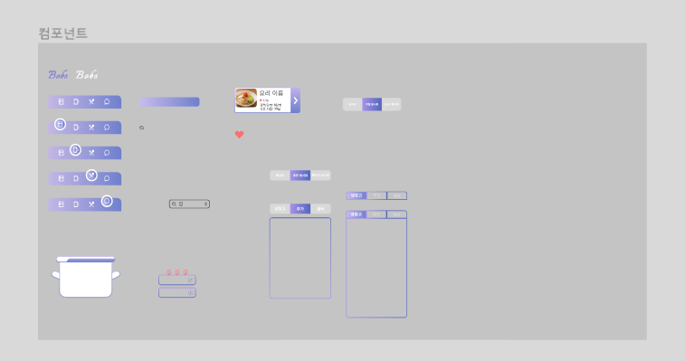

# 3주차 과제

---

### 2023.01.25(수)

## [LIVE] 스마트 홈 IoT 연동 표준 매터(Matter)

### 스마트 홈 IOT 서비스 이용 과정

1. 제품구매 

2. 구매한 제품 설치 

3. 환경설정(앱 설치) 

4. IOT 디바이스/서비스 간 연동

## 매터(matter)란?

- 2019년 Zigbee Alliance에 의해 project CHIP 시작

- 2021년 Zigbee Alliance는 CSA로 Project CHIP는 Matter로 명칭 변경

- 여러 플랫폼에서 공통으로 활용할 수 있는 통합 프로토콜

### 매터의 특징

- 단순성 
  
  - 구매 및 사용이 간편

- 상호 운용성 
  
  - 여러 브랜드 장치가 함께 작동

- 신뢰서
  
  - 일관되고 반응이 빠른 로컬 연결

- 보안 
  
  - 강력하지만 간소화

### 메터 구조

#### 스레드(Thread) 프로토콜

- IEEE 802.15.4

- 저전력

- Mesh Network 
  
  - 그물망처럼 촘촘히 연결된 부분이 각각의 환경에서 동작할 수 있도록 해줌

- IPv6 기반

#### 메터의 구성

클라우드가 인터넷을 통해 연결되고 메터가 있는 디바이스들이 스레드라는 기술을 만나게 되면 mesh 네트워크가 서로 연결이 되어 각각의 네트워크를 구성하게 된다. 보더 라우터는 네트워크가 끊기게 되면 다른 네트워크를 찾게 된다. 또 다른 네트워크를 자동으로 찾아 IoT장치를 사용할 수 있게 된다. 다양한 장치로 연결이 가능하고 IP, 메터를 지원하지 않는 장치도 메터지원하는 허브로 모든 디바이스 연동이 가능한 구조를 가지게 된다.

#### 매터에 대한 전망

- 2023년부터 2030년 사이에 55억개의 매터 지원 스마트홈 제품 출시 전망

- 향후 5년 내에 스마트홈 디바이스 제조사의 절반 이상 메터 지원 예정

#### 메터 최신 동향

- 메터 Spec 1.0이 2022년 10월 발표되어 10여종의 디바이스 유형 지원

- 삼성전자의 smart things hub가 최초로 메터 인증 획득

#### 최신 매터 지원 기기

- 삼성전자 Smart Things station 2023년 CES에서 공개

- 140억개의 커넥티드 기기들을 연결하기 위한 기술 비전

### 메터 참고 사이트

- 오픈 소스 : https://github.com/project-chip/connectedhomeip

- CSA의 매터 정보: https://csa-iot.org/all-solutions/matter

## 

## 와이어프레임

- 메인 컬러 다시 정함
  
  - 메인 컬러에 맞게 수정작업 진행
    
    

- 화면 구성 수정
  
  

- 컴포넌트 만들기
  
  

## React

### 컴포넌트 생성

- 

### 파일 구조 다시 생각하기

- compents와 pages로 구성