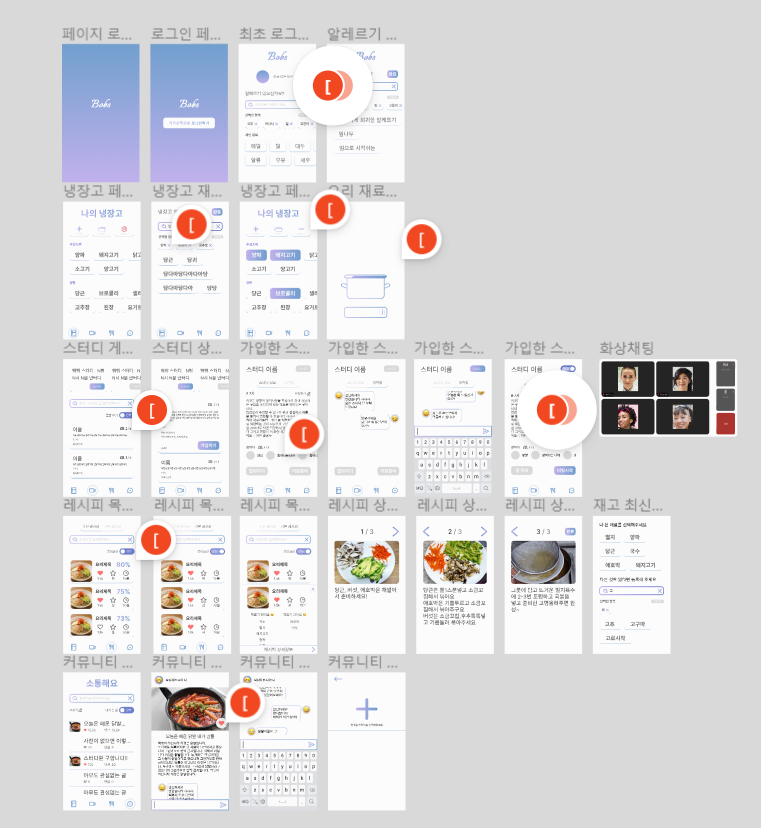
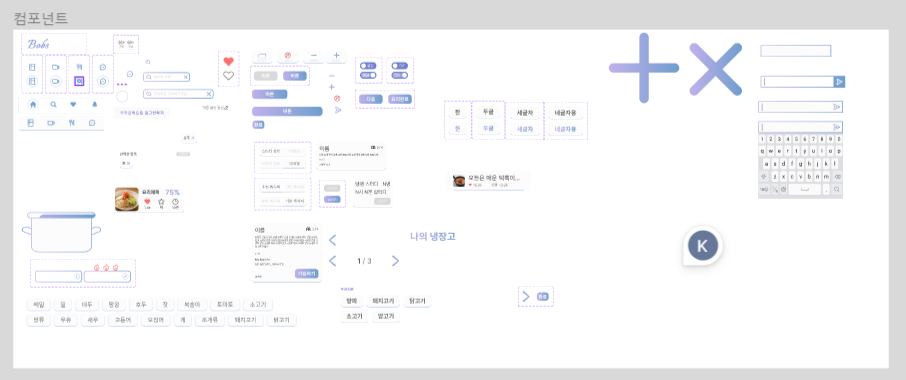

# 4주차 과제

---

### 2023.02.02(목)

## 와이어 프레임 수정

## 컴포넌트 만들기, 배리언츠 만들기

### CSS 마진, 패딩 맞추기

- margin
  
  - 화면 상/좌/우 margin 30px
  - 기능적으로 관련없는 컴포넌트 margin 30px
  - 기능적으로 관련된 컴포넌트 margin 20px
  - 컴포넌트 내 요소의 거리 margin 15px

- padding
  
  - 5px, 10px, 15px