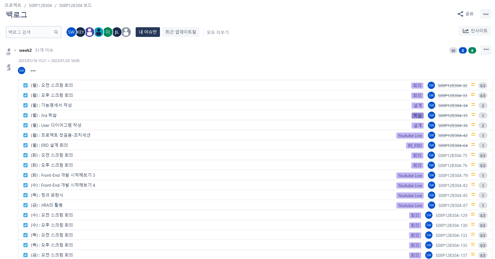
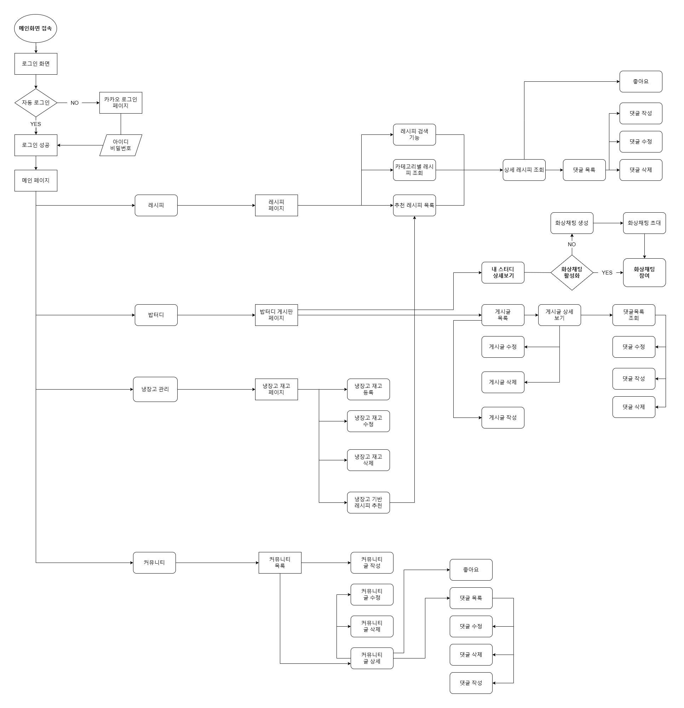

# 20230116

## Jira 학습

---

이슈 관리

- epic - 큰 틀
- stroy - 개발 관련 이슈
- task - 비개발 관련 이슈
- 이슈 당 스토리 부여(최대 4점을 넘지 않도록)
- (요일) : 내용 으로 작성하기

스프린트

- 주 단위
- 진행중인 이슈 진행중으로 바꾸기
- 완료된 이슈 바로바로 완료처리 하기

번다운 차트

- 가이드 라인에 따라 이슈가 번 다운 되도록 설정하기

## 기능명세서 작성

---

## Flow Chart

---

