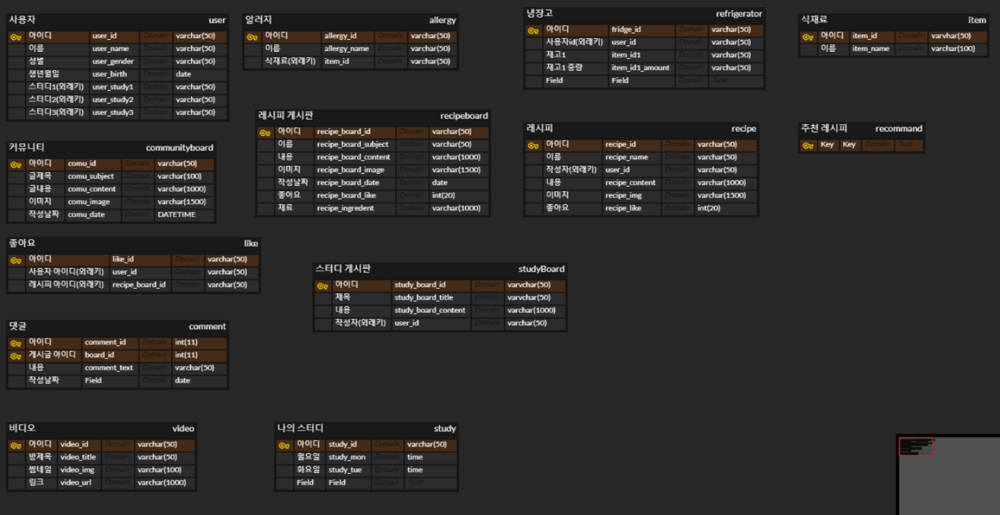
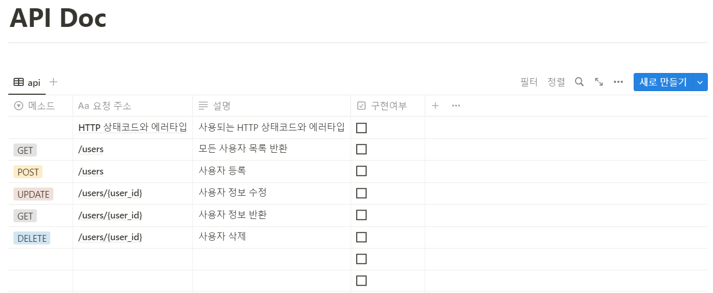

# 20230117

---

## 스크럼 회의

---

- 오늘의 안건
    - 공통으로 해야 할 일
        - ERD : 속성 값 작성
        - 화면설계 : 냉장고, 레시피
    
    - 분리되어 진행 할 일
        - 백
            
            ERD 속성 값 작성
            
    
    - 우리 팀 규칙 회의
        - 깃 컨벤션
            
            [notion 주소](https://www.notion.so/105476d67d874fe4b6b37bea7951c3f8)
            

## ERD 작성 시작 (진행중)

---

- table 정의
- 속성 정의
- 내일 관계선 정의
- 소문자 규칙

## API Doc 작성 시작 (진행중)

---

- API 규칙 정의
- 기능별 url 정의 시작

