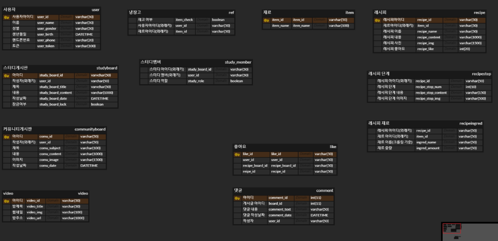

# 20230118

## ERD 학습(출처 : https://velog.io/@sontulip/how-to-db-design)

---

1. **무결성 - 데이터베이스 내에 모든 값은 언제나 정확한 값을 유지해야 한다.**
2. **유연성 - 데이터베이스 구조는 요구사항 변화에 대해 수정이 쉬워야 한다.**
3. **확장성 - 데이터베이스 구조는 기능 확장에 대해서 수정이 쉬워야 한다.**

**자연키 장점**

1. MySQL의 InnoDB스토리지 엔진의 경우 기본키를 바탕으로 테이블 자체가 클러스터링 인덱스가 되기 때문에 자연키를 기본키로 한다면 이 자연키를 위해 따로 인덱스를 구성할 필요가 없음
2. 커버링 인덱스가 작용할 가능성이 높음

**자연키 단점**

1. 비즈니스 요구사항의 변화로 인해서 기본키로 사용하던 자연키를 변경해야 할 수 있음.예를 들어 회원 테이블에 주민번호를 기본키로 사용했는데 주민번호를 저장하지 못하도록 법이 개정되면 문제가 생길 수 있음.

**인조키 장점**

1. 비즈니스 요구사항 변화에 전혀 영향받지 않기 때문에 변경할 일이 없음

**인조키 단점**

1. 인덱스를 추가로 구성해주어야 할 수 있음.
2. 인조키를 위한 필드가 추가되어 테이블이 커짐.

자연키의 장점은 '성능', 인조키의 장점은 '유연성'이라고 할 수 있음.

**다중값 또는 다중 부분 필드들을 포함하지 않는다.**

**DATETIME vs TIMESTAMP - 생성일시, 수정일시**

****일대일 관계, 일대다 관계, 다대다 관계****

## **식별 관계 vs 비식별 관계**

식별 관계는 자식 테이블이 부모키의 기본키를 자신의 기본키에 포함하는 경우를 가리킴

식별 관계는 항상 부모 테이블에 데이터가 먼저 존재해야 하므로 만약 자식 테이블에 데이터가 먼저 생성이 가능하도록 비즈니스 요구사항이 변경된다면 대응하기가 힘듬

## **기호 사용**

1대1 관계이면서 최소 0개의 자식과 연관되어야 하는 경우

1대1 관계이면서 최소 1개의 자식과 연관되어야 하는 경우

1대다 관계이면서 최소 0개의 자식과 연관되어야 하는 경우

1대다 관계이면서 최소 1개의 자식과 연관되어야 하는 경우

## ERD 작성

---

