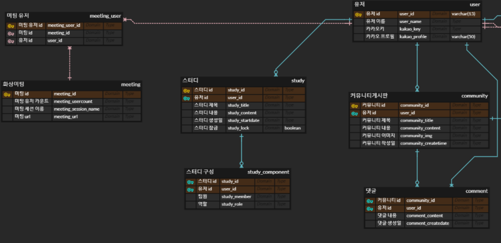

# 20230119

## ERD 설계

---

## API 문서 작성

---

### API 컨벤션

**1. 복수 > 단수**

**2. 명사 > 동사**

**3. 하이픈(-) > 밑줄(_)**

**4. 소문자 > 대문자**

**5. 컬렉션 필터링: URL 쿼리 > 새로운 API
기**

## 기능 명세서 수정

---

## 컨설팅 회의

---

- 레시피 / 밥터디 검색 기능 추가
- 메인 페이지 → 처음 로그인 : 알러지 등록 페이지
    
                        ㄴ> my 냉장고
    
- 추천 레시피 리스트에서 사용자를 설득 할 수 있어야 한다.
    - 일치율
    - 좋아요 순
    
    → 사용자가 납득이 가는 추천 순서여야 한다.
    
- 목록에서 레시피 단계 수 / 조리 시간을 볼 수 있게 해주어야 함
- 현재 스터디 상태를 보여줌.
- 커뮤니티는 인스타그램 벤치 마킹 하는 것으로.
- 일반 레시피 제공( 상위 2개는 일주일 간 좋아요 갯수 / 등록 순(관리자) )

## 그 외

- 유저 성별 / 생일 정보는 빼는 게 좋다.
- 카카오 알림톡(유료 / 무료) 확인 필요
- 닉네임 변경 기능은 빼는걸로
- 레시피 단계는 통째로 가져와서 관리를 하는 것이 좋겠다.
- 댓글 / 좋아요 테이블은 다 분리하는 걸로