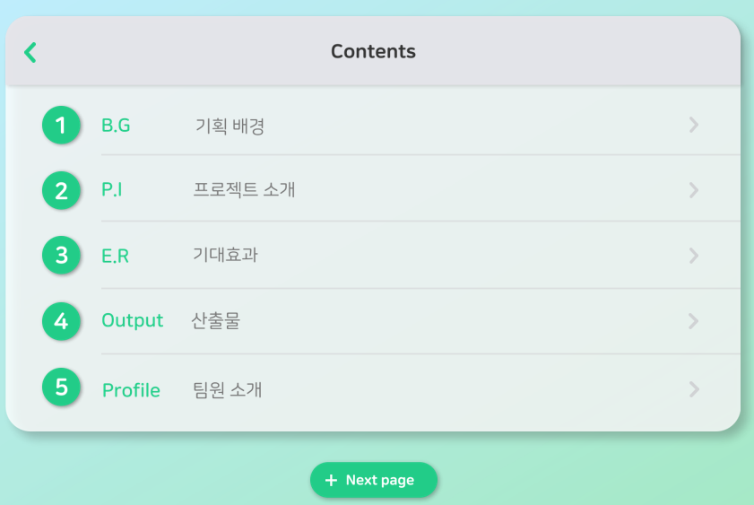

# 20230126

## 컨설팅

---

컨설팅 내용

- ERD
    - 스터디 락 → 캐시로 : 이렇게 해야 세션이 생겼을 때 막을 수 있다. // 세션 표시로.
    - 스터디 인원이 가득 찼을 때에는 클릭을 못하게 프론트가 막고 백에서도 막아 주어야 함.
    - 화상 채널이 열리면 못들어오고, 인원이 가득 차면 못들어오게 하는 제한을 백과 프론트가 모두 걸어주어야 함. (2개 씩)
        - 이유는 프론트와 백의 갭이 있을 수 있기 때문. 프론트에서는 잔여가 보일 수 있지만, 실제로는 풀방일 수 있는 갭이 존재할 수 있음
        - 검색은 방 이름으로 검색 할 수 있도록 함.( 넘버랑 이름을 같이 해주는 것이 좋겠다.)
        - 검색기능을 살릴지 말지를 고민 해봐야 함.( 넘버를 입력하면 바로 방으로 가입하는 것으로 하던지. 아니면 이름도 검색이 가능하게 해서 필터링을 하게 하던지. 둘 중에 하나로.
            
            스터디 이름을 검색하려면 인덱스 테이블을 설게해야 함.)
            
        - 스터디 이름은 10자 이내로 조정할 것.
    - 프론트에서 핸들링해야함.(세션이 열린 애들 + 가입한 애들 → 보여지면 안됨)
    - 인피니티 스크롤 할 때 마다 불러오는 것이 가능하고 좋음.
    - 스터디/스터디 구성에서 방장을 하나 날리거나 역할을 날리는 방법이 있음

- 커뮤니티
    - 사진 첨부는 파일 첨부로 해야 함.
    - 사진은 multi로 했음 좋겠다.
    - 해시태그는 빼도 상관없음. 넣어 놓고 추후에 어떻게 사용하겠다는 것도 가능함.
    - 커뮤니티 생각을 많이 해봐야겠음. → SNS 로 할건지 게시판으로 할 건지. → 아예 빼버리든가

- 에러 메세지
    - 우리끼리 정하고 프론트에는 넘버만 백과 프론트는 내용을 알고 있으면 됨. 해킹문제가 있을 수 있음. 리스크가 크다.
    
- API
    - 스웨거로 이동하는 것이 좋다.
    - 자동으로 다해주고 로그가 남아 좋다.
    
    - 일관성 유지 : URL/헤더/인증/상태코드
    - ISO8601 UTC 날짜 포맷 사용
    - Public Endpoint만 인증 예외. 나머지는 모두 인증 필수
    - 헬스 체크 Endpoint 제공
    - API 버저닝
    - API 키 인증 적용
    - 합리적인 HTTP 상태코드 와 메소드 사용
    - 각 Endpoint에 자체만으로 설명 가능한 간단한 이름을 사용
    - 표준 에러 응답 사용
    - POST에서 생성된 자원을 리턴
    - PUT 대신 PATCH
    - 최대한 구체적으로
    - Pagination 사용
    - 각 자원을 확장 가능하게 (expand 등의 쿼리 파람을 줘서 추가 정보도 리턴 가능하게 설계)

## 발표자료 완성

---

기획의도 및 배경

1. 불규칙적인 식사
2. 혼밥
3. 배달쓰레기
4. 생활 속에서 쉽게 실천할 수 있는 활동을 통해 일상에 활력을 주고 심리적 만족감과 성취감을 얻으려는 MZ세대

PPT 구성

