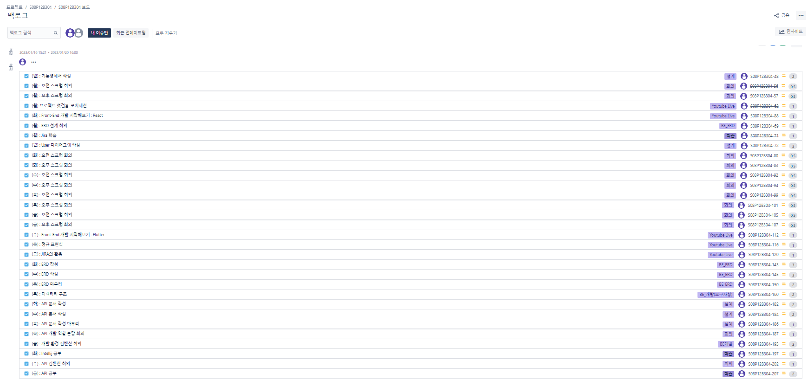
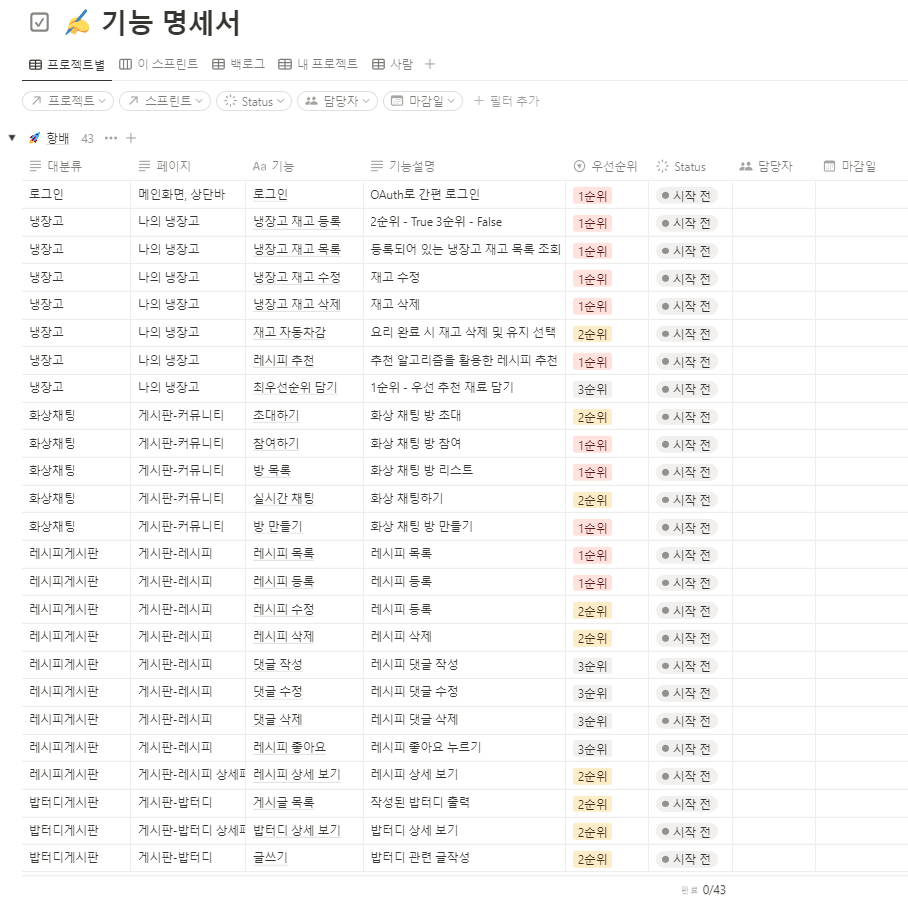
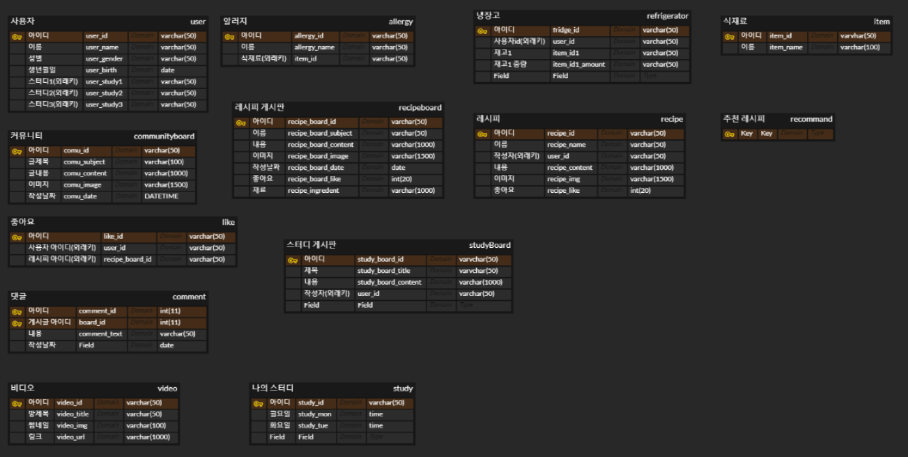

# 2주차


### 01/16 (월)

1. GIRA 2주차 계획 구성



2. 사용자 기능 명세서 작성




### 01/17 (화)

1. Intellij 공부

2. ERD 설계 - 작성중



### 01/18 (수)

1. 레시피 크롤링 공부 
(참고 : 만개의 레시피)

```

for (int i = 0; i < list.size(); i++) { //0부터 list의 사이즈까지 반복
  WebElement tag = list.get(i).findElement(By.tagName("span"));
  // list의 i번째에서 tagName이 span인 요소 tag에 담기 
  
  String spanText = tag.getText();
  // tag의 text를 가져와 spanText에 담기
}

```

2. ERD 설계 (구체화)
