# 2주차


### 01/16 (월)

1. GIRA 2주차 계획 구성


2. 사용자 기능 명세서 작성


### 01/17 (화)

1. Intellij 공부

2. ERD 설계 - 작성중


### 01/18 (수)

1. 레시피 크롤링 공부 
(참고 : 만개의 레시피)

```

for (int i = 0; i < list.size(); i++) { //0부터 list의 사이즈까지 반복
  WebElement tag = list.get(i).findElement(By.tagName("span"));
  // list의 i번째에서 tagName이 span인 요소 tag에 담기 
  
  String spanText = tag.getText();
  // tag의 text를 가져와 spanText에 담기
}

```

2. ERD 설계 (구체화)
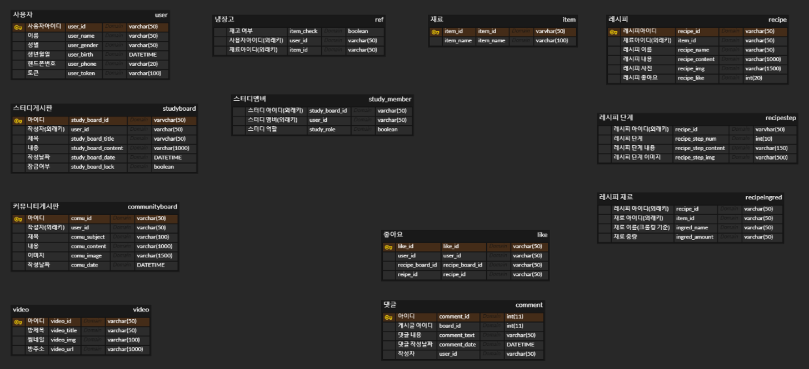


### 01/19 (목)

1. ERD 설계 (거의 확정)
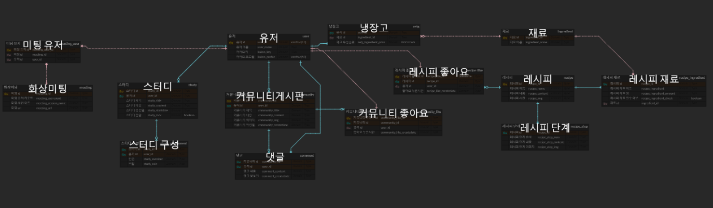


2. API 문서 - 작성중
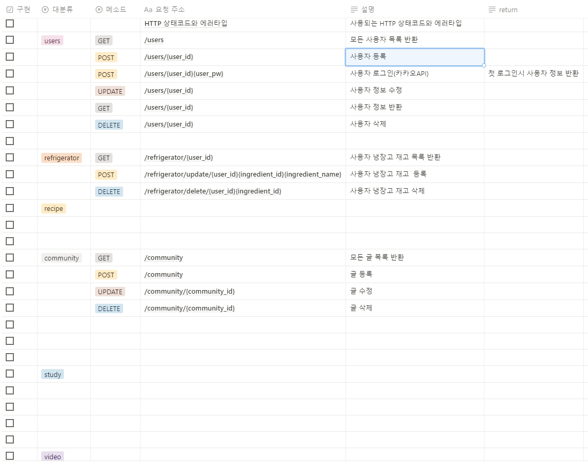


### 01/20 (금)

1. API 문서 수정
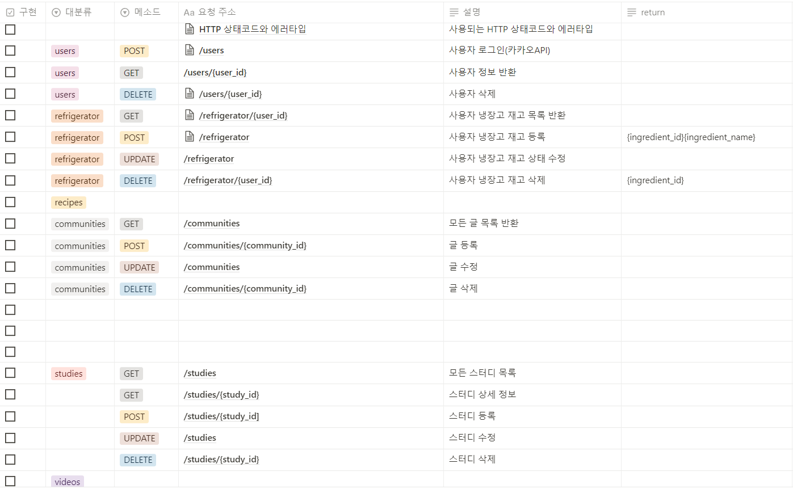

2. 인텔리제이 개발 환경 세팅
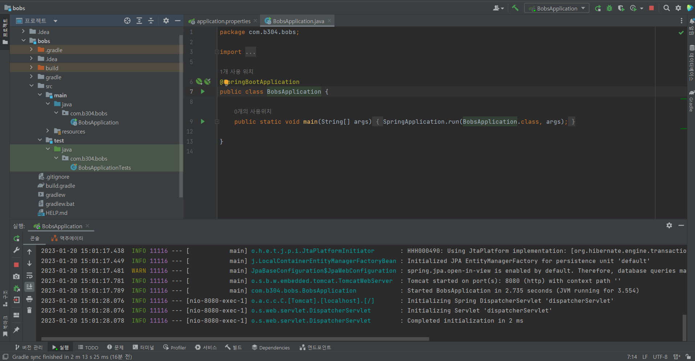


# 3주차


# 01/25 (수)

1. API 문서 (거의 확정)
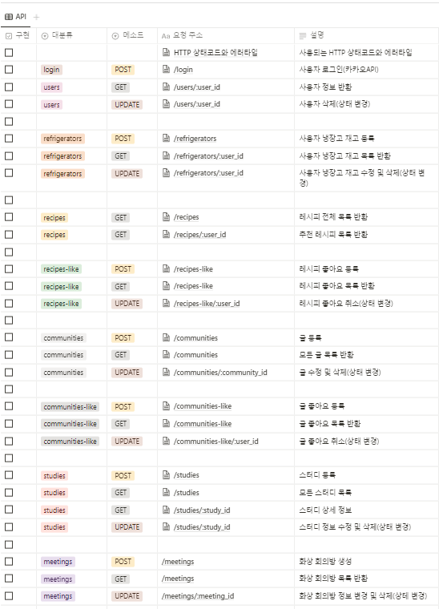

2. 중간 발표 PPT 제작
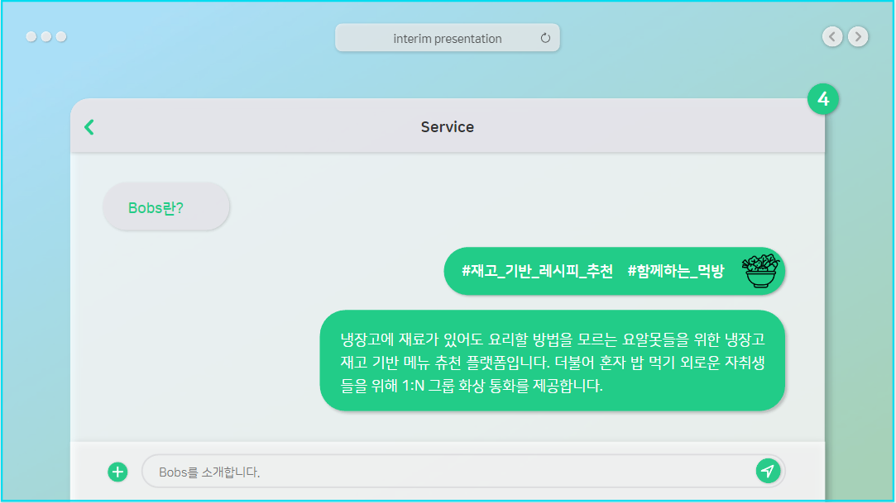


# 01/26 (목)
- 중간 발표 PPT 완성
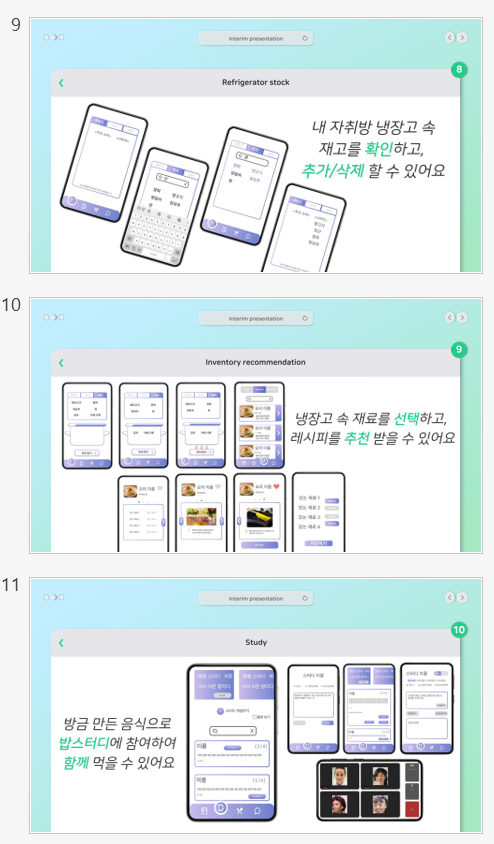
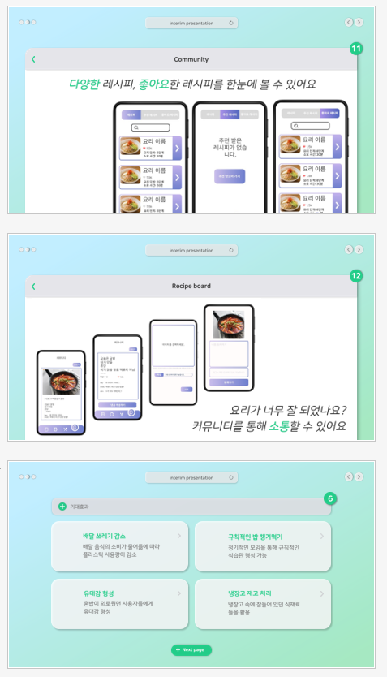


# 01/27 (금)
- webRTC 개발 환경 셋팅 및 샘플 구현

```
<script>
import axios from 'axios';
import { OpenVidu } from 'openvidu-browser';
import UserVideo from './components/UserVideo';

axios.defaults.headers.post['Content-Type'] = 'application/json';

const OPENVIDU_SERVER_URL = "https://" + location.hostname + ":4443";
const OPENVIDU_SERVER_SECRET = "MY_SECRET";

export default {
	name: 'App',

	components: {
		UserVideo,
	},

	data () {
		return {
			OV: undefined,
			session: undefined,
			mainStreamManager: undefined,
			publisher: undefined,
			subscribers: [],

			mySessionId: 'SessionA',
			myUserName: 'Participant' + Math.floor(Math.random() * 100),
		}
	},

	methods: {
		joinSession () {
			// --- Get an OpenVidu object ---
			this.OV = new OpenVidu();

			// --- Init a session ---
			this.session = this.OV.initSession();

			// --- Specify the actions when events take place in the session ---

			// On every new Stream received...
			this.session.on('streamCreated', ({ stream }) => {
				const subscriber = this.session.subscribe(stream);
				this.subscribers.push(subscriber);
			});

			// On every Stream destroyed...
			this.session.on('streamDestroyed', ({ stream }) => {
				const index = this.subscribers.indexOf(stream.streamManager, 0);
				if (index >= 0) {
					this.subscribers.splice(index, 1);
				}
			});

			// On every asynchronous exception...
			this.session.on('exception', ({ exception }) => {
				console.warn(exception);
			});

			// --- Connect to the session with a valid user token ---

			// 'getToken' method is simulating what your server-side should do.
			// 'token' parameter should be retrieved and returned by your own backend
			this.getToken(this.mySessionId).then(token => {
				this.session.connect(token, { clientData: this.myUserName })
					.then(() => {

						// --- Get your own camera stream with the desired properties ---

						let publisher = this.OV.initPublisher(undefined, {
							audioSource: undefined, // The source of audio. If undefined default microphone
							videoSource: undefined, // The source of video. If undefined default webcam
							publishAudio: true,  	// Whether you want to start publishing with your audio unmuted or not
							publishVideo: true,  	// Whether you want to start publishing with your video enabled or not
							resolution: '640x480',  // The resolution of your video
							frameRate: 30,			// The frame rate of your video
							insertMode: 'APPEND',	// How the video is inserted in the target element 'video-container'
							mirror: false       	// Whether to mirror your local video or not
						});

						this.mainStreamManager = publisher;
						this.publisher = publisher;

						// --- Publish your stream ---

						this.session.publish(this.publisher);
					})
					.catch(error => {
						console.log('There was an error connecting to the session:', error.code, error.message);
					});
			});

			window.addEventListener('beforeunload', this.leaveSession)
		},

		leaveSession () {
			// --- Leave the session by calling 'disconnect' method over the Session object ---
			if (this.session) this.session.disconnect();

			this.session = undefined;
			this.mainStreamManager = undefined;
			this.publisher = undefined;
			this.subscribers = [];
			this.OV = undefined;

			window.removeEventListener('beforeunload', this.leaveSession);
		},

		updateMainVideoStreamManager (stream) {
			if (this.mainStreamManager === stream) return;
			this.mainStreamManager = stream;
		},

		/**
		 * --------------------------
		 * SERVER-SIDE RESPONSIBILITY
		 * --------------------------
		 * These methods retrieve the mandatory user token from OpenVidu Server.
		 * This behavior MUST BE IN YOUR SERVER-SIDE IN PRODUCTION (by using
		 * the API REST, openvidu-java-client or openvidu-node-client):
		 *   1) Initialize a Session in OpenVidu Server	(POST /openvidu/api/sessions)
		 *   2) Create a Connection in OpenVidu Server (POST /openvidu/api/sessions/<SESSION_ID>/connection)
		 *   3) The Connection.token must be consumed in Session.connect() method
		 */

		getToken (mySessionId) {
			return this.createSession(mySessionId).then(sessionId => this.createToken(sessionId));
		},

		// See https://docs.openvidu.io/en/stable/reference-docs/REST-API/#post-openviduapisessions
		createSession (sessionId) {
			return new Promise((resolve, reject) => {
				axios
					.post(`${OPENVIDU_SERVER_URL}/openvidu/api/sessions`, JSON.stringify({
						customSessionId: sessionId,
					}), {
						auth: {
							username: 'OPENVIDUAPP',
							password: OPENVIDU_SERVER_SECRET,
						},
					})
					.then(response => response.data)
					.then(data => resolve(data.id))
					.catch(error => {
						if (error.response.status === 409) {
							resolve(sessionId);
						} else {
							console.warn(`No connection to OpenVidu Server. This may be a certificate error at ${OPENVIDU_SERVER_URL}`);
							if (window.confirm(`No connection to OpenVidu Server. This may be a certificate error at ${OPENVIDU_SERVER_URL}\n\nClick OK to navigate and accept it. If no certificate warning is shown, then check that your OpenVidu Server is up and running at "${OPENVIDU_SERVER_URL}"`)) {
								location.assign(`${OPENVIDU_SERVER_URL}/accept-certificate`);
							}
							reject(error.response);
						}
					});
			});
		},

		// See https://docs.openvidu.io/en/stable/reference-docs/REST-API/#post-openviduapisessionsltsession_idgtconnection
		createToken (sessionId) {
			return new Promise((resolve, reject) => {
				axios
					.post(`${OPENVIDU_SERVER_URL}/openvidu/api/sessions/${sessionId}/connection`, {}, {
						auth: {
							username: 'OPENVIDUAPP',
							password: OPENVIDU_SERVER_SECRET,
						},
					})
					.then(response => response.data)
					.then(data => resolve(data.token))
					.catch(error => reject(error.response));
			});
		},
	}
}
</script>
```

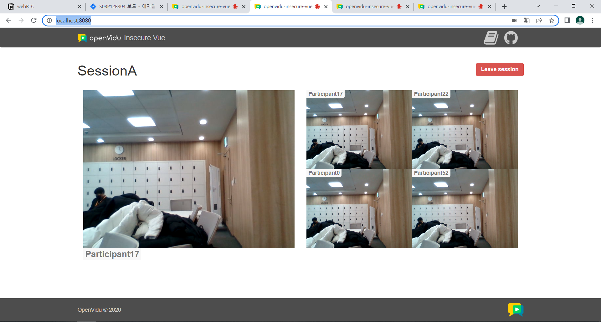


# 4주차


# 01/30 (월)
- erd 완성 및 적용
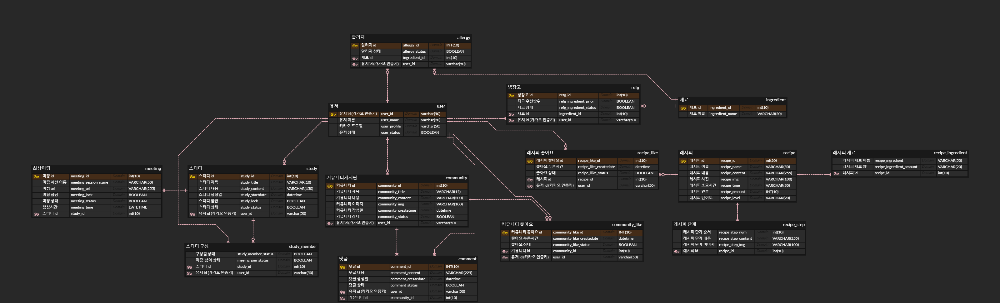